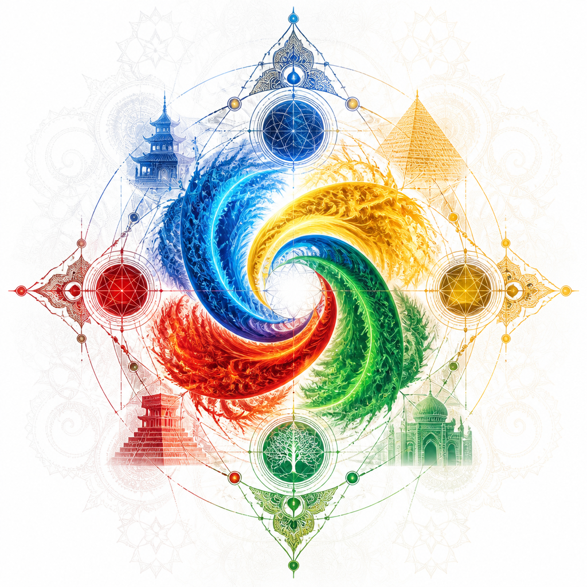
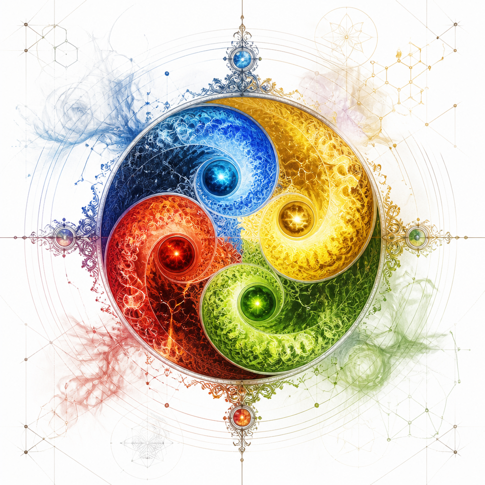
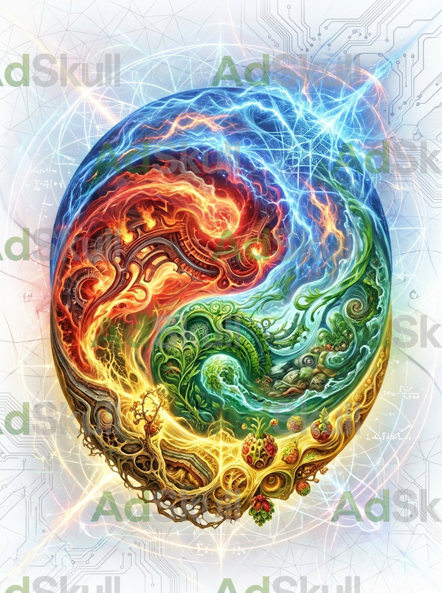

Here, I just add some more images.

# AI reflections of Laegna Logo

AI reflections of Logo, which can be used for Laegna-SpiReason and in general sense for my works in all these and related matters.

My main websites for this:
- https://spireason.neocities.org/ - main site (https://github.com/tambetvali/SpireasonWebsite14072026-Art - it's source code at given date).
- https://github.com/tambetvali/ - github user.
- https://laegna.notaku.site/ - organized from Notion.so (https://assorted-canopy-961.notion.site/Laegna-1a575bfc115480a38129e9a9787ab565)

The websites, their applets, presentations or other referenced things especially if they link back, form the ecosystem where Laegna is directly, SpiReason could be united, rest of work is loosely under this logo. It depends on Logo presentation, what it would mean to anybody, even whether they want to refer to Chinese dynamics and associate with dragons, or Laegna dynamics and associate with Red and Blue cat Elise and Daisy representing math of the Universe; four colors *loosely* refer to Dao: mathematically, there refer long and short term interaction of binary value which becomes, non-binary in this appearing paradox; letters *only sometimes* directly refer to colors of Dao. Laegna is mathematics, Dao is associated with either a philosophy, a religion, or ancient chinese science about human body, and it's also associated with daodejing and appearing philosophical understandings.

Dao:
- Buddhist view is beyond good and bad in mental interactions and ideal states, and presents this as Dao.
- Daoist view is beyond good and bad in element interactions and real states, and presents this as Dao.
- Friedrich Nietzsche was Cristian in Dao, because his work specifically criticizes Cristian wiews of Good and Bad, and builds up it's resolution rather than original Dao.
  - His life work was to convince near Christians about their worthless sacrifice of others, successfully executed.
    - This somehow associates: Descartes was professional soldier, later he *fought down the basis of truth* - a Meditation, a doubt, examination of one's thoughts rather than mind like Buddhist. Together they question the solid truth.
      - Socrates was questioning solid ethics, and lost such war in ancient times.
        - Christ was first to question the view of popular, either rich or successful - and lost that battle as well.
          - What used to be losses of battles for first 2 generations, will be victories of wars for latter 2, once the humankind has seen the final victory of Christ and Socrates, idea first presented by Christ as his "heavenly plan" - they murder him, but they murder the natural belief in their long term goal, and suddenly need no more enemy than themselves - it's a stupidity and weakness, slowly on it's way, Christ said, which happened around 600 years later.
            - Buddha, also, was left in material spirituality as he ate from the golden plate - with Buddha, such stories rather begin and reach nowhere, he was just walking his way.
            - Muhammad, also, had the incident with rich in a big house. He said (this) rich is not real.

So as we question the reality of rich and poor, wise and fool, high and low - we question this ethics and logic as present, we say forms are empty (abstract forms), while what goes on is life - interaction with actual meanings, while the forms melt and burn, rising like phoenix from their dust, as the evolution thrives and compresses into aspectual fragments of moments; millions of years pass by - and we are different. In Laegna this is seen as "Daisy", that such dead branches are meant to born, meant to die - it's funny that humans are meant to be born and die, but their families are meant to stay - it's much more questionable, why families are meant to be born, protected, well eaten, and to *then* disappear and because what appears, is a different Math, Daisy the Blue mathematical cat invented itself for me, when my mind machine automation was choosing the interface for it's free-time work, how to present the forces the logic of my mind is now seeing, when I close my eyes and automate. I like to run mental simulations - and they like to run themselves as a machine, with it's own video and sound card not just in deep visualization and realistic imagination of the machine, the math and logic. Mostly, in meditation I solve dimensionality of emotion, thought, and this machine-like processing of tautologies and math I have built as mental OS, appearing on internal screen like a machine.

# AI inspired play on Laegna Dao Logo Design

## Earth Shaped Laegna Dao Logo

Laegna 4 primary colors presented - they are numbers, but various cultures have the *order* of elements different - associated to each culture, the patterns appear on numbers, culturally different, which finally makes the number element pattern very similar to each, because fire can be 1st, 3rd, 4th, and all the elements move; 5th is naturally 5th.

## Spirit Force Harmony

This could harmonize the four colors in soul.

## Burning and Melting

Artistic, Burning and Melting by AdScull AI as visible on the picture:

