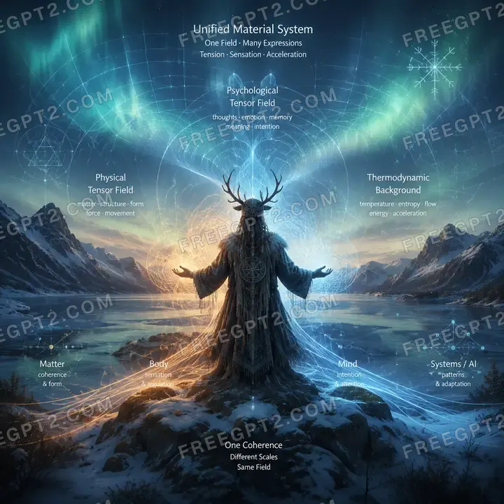
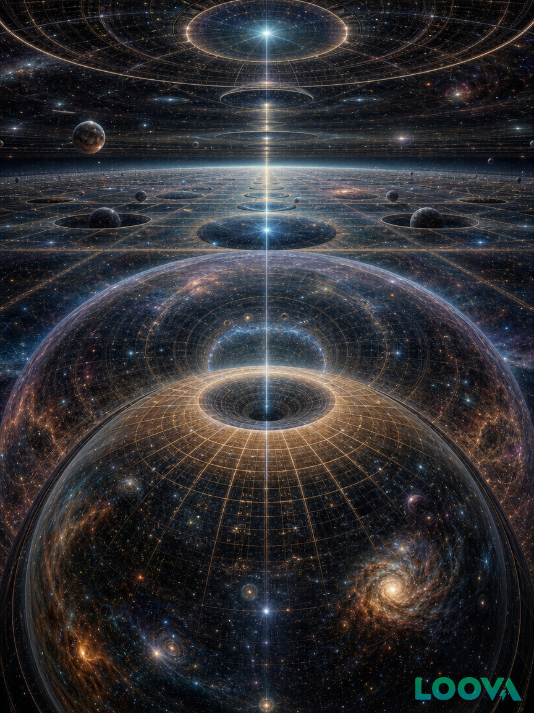
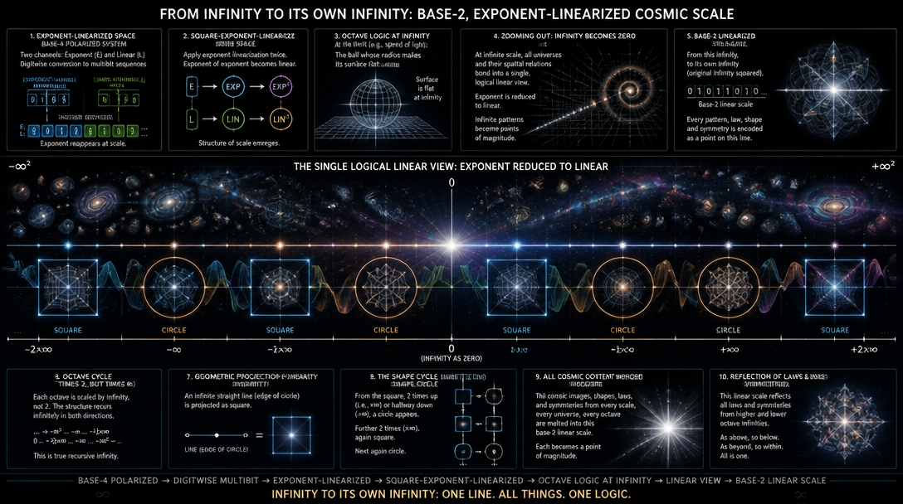
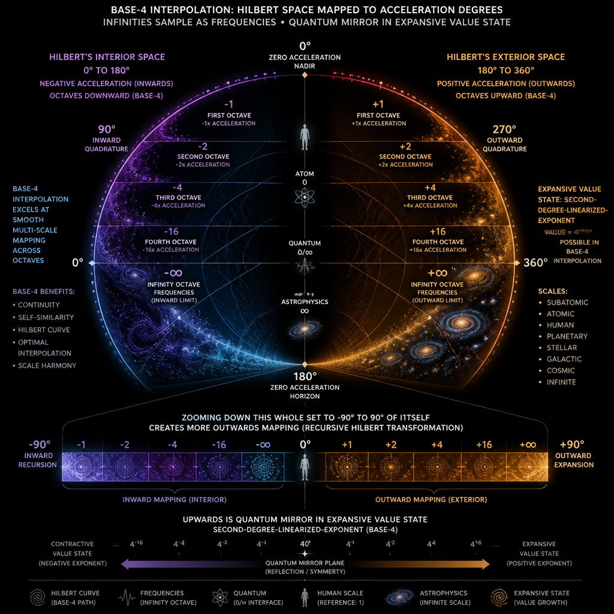
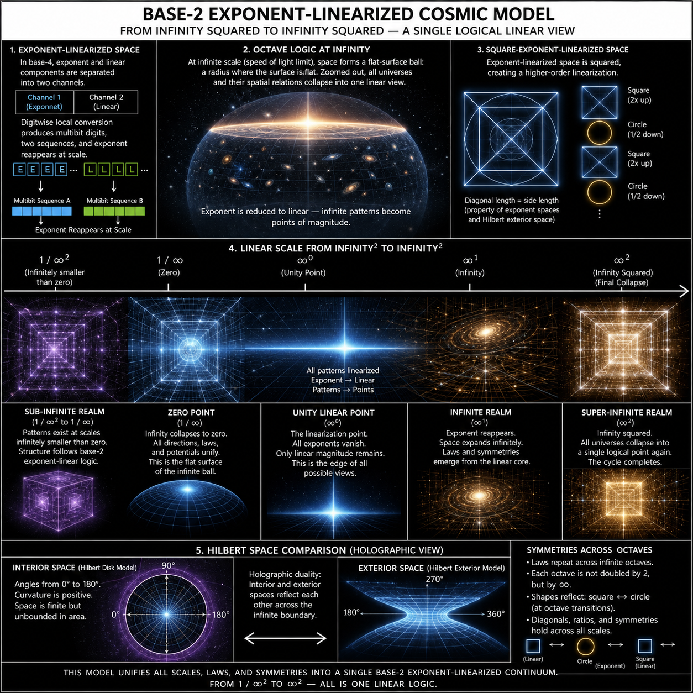
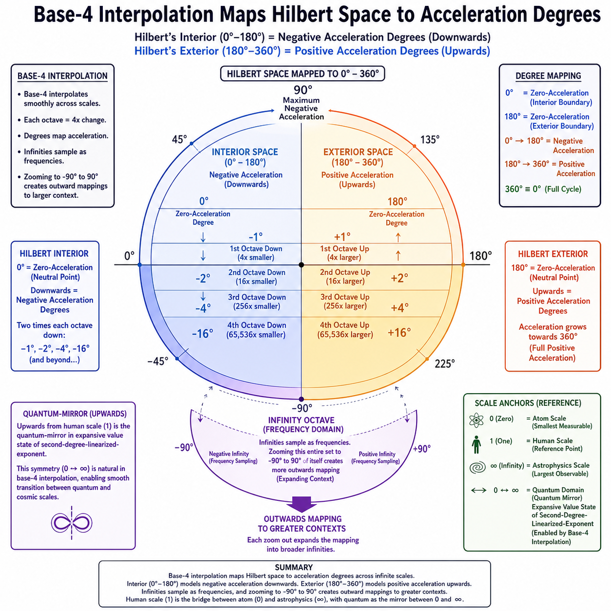
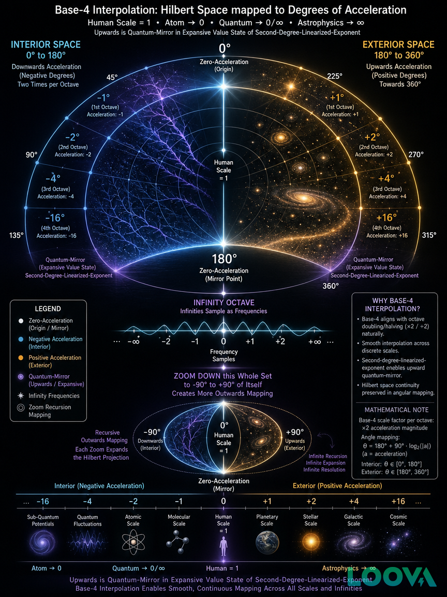

This is second of infinity introductions series - you can map more complex math based on these logical templates, and verify what really exists in sky yourself.

# Three Tensor Fields

This is kind of "Viking image" - it's trinity of three tensor fields, human-AI-physics, which can be finally seen in same terms and models, as tensions to resolve in a field (math below is about any and all of them, and their supersystems - actually any coherent mathematical system is thermodynamic tensor field, if it's not utmost ideal, impossible in reality):

# Graphics, Spheres and Patterns

Imagine topologies. They happen in Spatial Curvatures and their octave levels, compared to linear scale and themselves.

What is *internal*, what is *external*?

# Vague Ideas

Asking AI to explain only what it understands precisely, closes text into dreamlike, unreadable graph of imaginative forms - an abstract..

# Infinity Octaves

We count infinity in octaves - because symmetries to music and wavefield patterns relate 2 to infinity and make it perceivable, inside-out smooth even by layers in their exact, octave-wise mapping, layers of scales, magnitudes, infinities:

# Interior and Exterior space

Infinity and poles, stacks of truth values, bands, frequencies, dimensions - all are simplified if we understand this, and you can find algebraic representation in Hilbert's math:

# Base-4 Interpolation

To make them smooth, you need interpolation-ready bases. Base-4 is based on base-2 symmetries, gives discrete, linear math about octaves - base-2, base-4, recursions.

# Logexp Logic in Spheres

