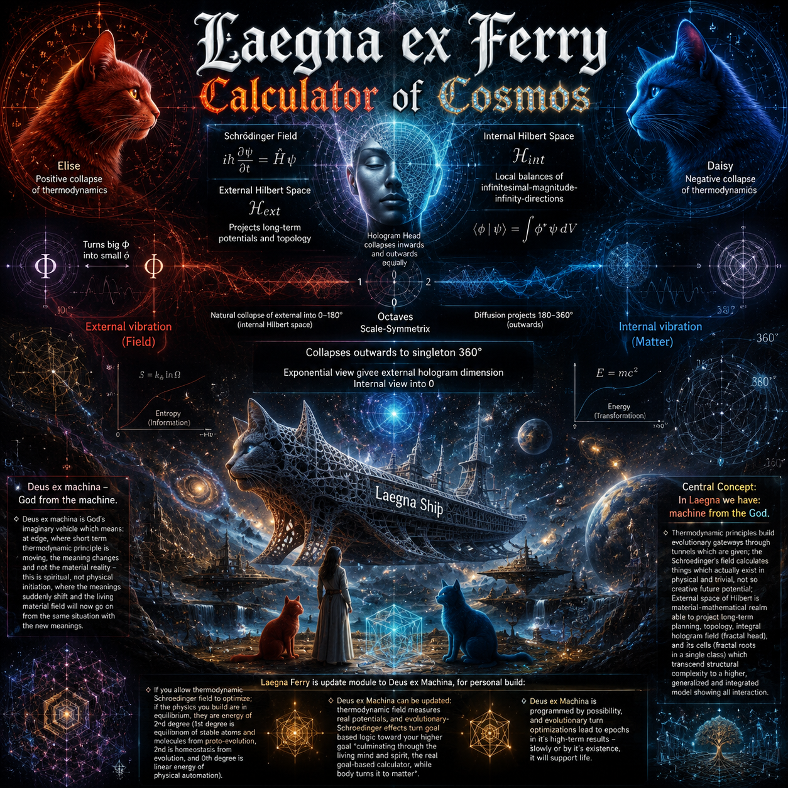
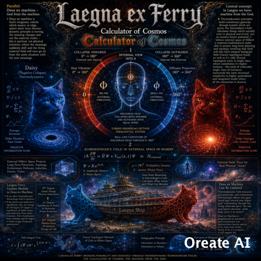
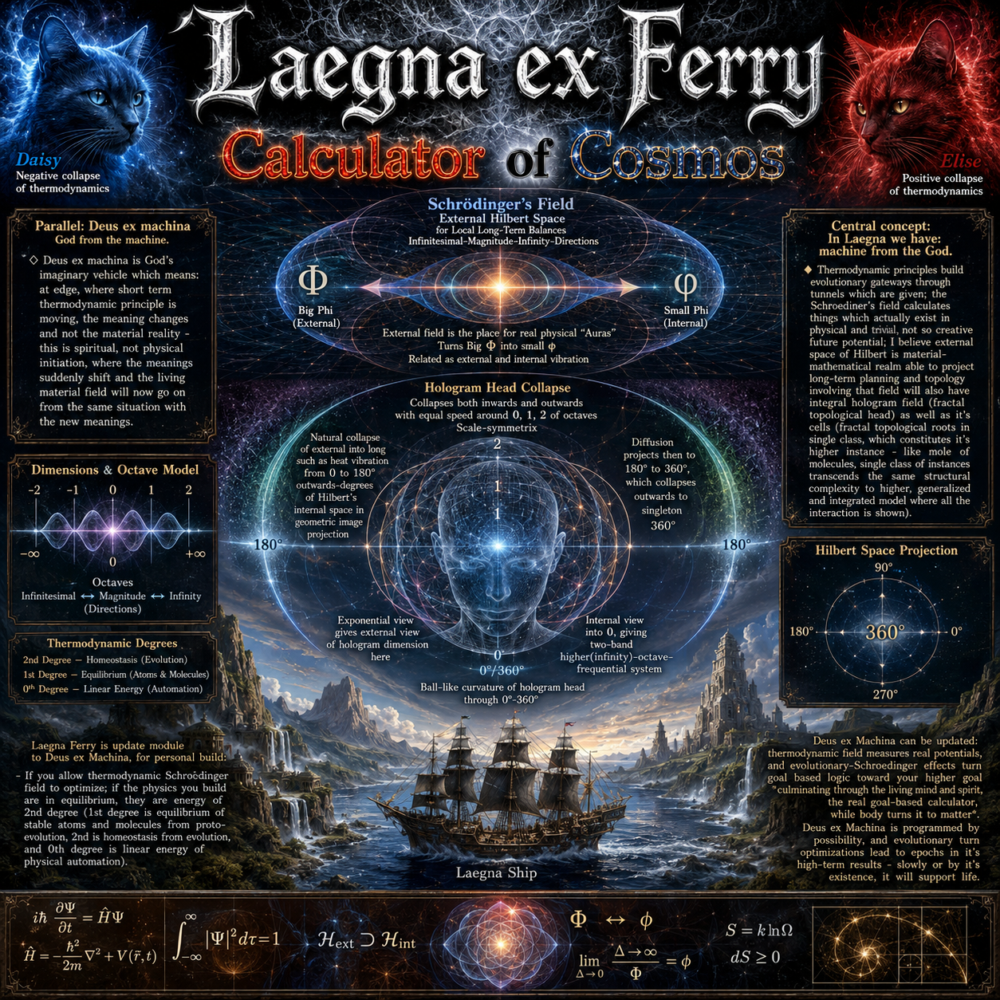
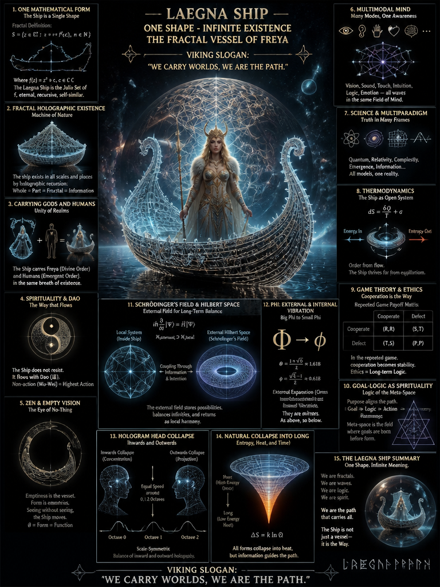
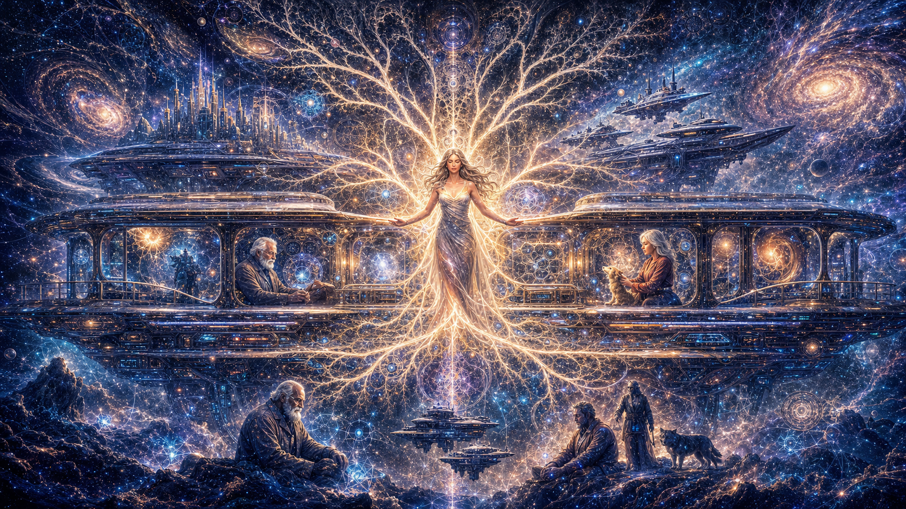
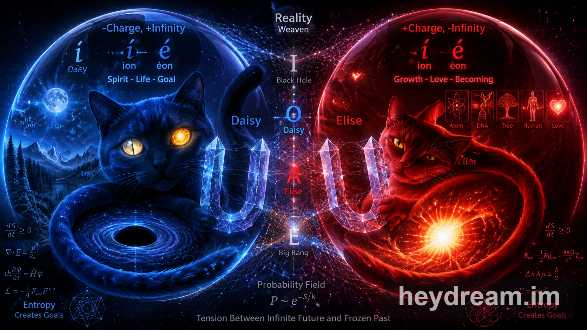

# Laegna Ex Ferry — Calculator of Cosmos  
*A fractal vessel of Freya, bridging mathematics, physics, and mythic consciousness.*

---

## Overview

The **Laegna Ex Ferry** project is a symbolic and mathematical art series exploring the unity between **thermodynamics**, **quantum mechanics**, **spiritual logic**, and **mythological archetypes**.  
It visualizes the **Laegna Ship**, a fractal-holographic vessel carrying **Freya**, the goddess of wisdom and flow, through the multidimensional ocean of existence.  
Each artwork merges **scientific equations**, **philosophical metaphors**, and **cosmic geometry**, forming a **Calculator of Cosmos** — a visual synthesis of mind, matter, and meaning.

---

## Conceptual Framework

### 1. The Fractal Vessel
The Laegna Ship is defined by recursive mathematical forms:

$$
S = \{ z \in \mathbb{C} : z_{n+1} = f(z_n), f(z) = z^2 + c, c \in \mathbb{C} \}
$$

It represents **self-similarity**, **infinite recursion**, and **holographic existence** — the idea that every part contains the whole.

### 2. Thermodynamic Duality
Two cosmic cats embody the thermodynamic balance:
- **Daisy (Blue)** — Negative collapse, entropy creation, inward flow.  
  $dS/dt \ge 0$
- **Elise (Red)** — Positive collapse, energy diffusion, outward expansion.  
  $\Delta S = k \ln \Omega$

Together they form the **dual thermodynamic field**, oscillating between equilibrium and evolution.

### 3. Schrödinger’s Field and Hilbert Space
The **external Hilbert space** projects long-term potentials:

$$
i\hbar \frac{\partial \psi}{\partial t} = \hat{H}\psi
$$

The **internal Hilbert space** realizes local balance:

$$
H_{\text{internal}} = \int \phi^* \hat{H} \phi \, d\tau
$$

This duality models **information coupling** between external possibility and internal realization — the physics of consciousness.

### 4. Phi Resonance
The golden ratio defines vibrational symmetry:

$$
\Phi = 1.618, \quad \phi = 0.618
$$

External expansion (Φ) and internal contraction (φ) form the **as-above-so-below** principle — the harmonic bridge between macrocosm and microcosm.

### 5. Hologram Head Collapse
Collapse occurs both inward and outward with equal velocity:
- **Inward (0–180°)** — Concentration, internalization.  
- **Outward (180–360°)** — Projection, diffusion.  
This creates a **ball-like curvature** of the hologram head, representing the **unity of perception and projection**.

### 6. Game Theory and Ethics
Ethics emerge from repeated cooperation:
| Action | Result |
|---------|---------|
| Cooperate | Stability |
| Defect | Entropy |
Long-term logic favors **cooperation**, aligning moral behavior with **thermodynamic efficiency**.

### 7. Logic as Spirituality
Logic is not cold calculation — it is **the Way**:

$$
\text{Logic} = \text{Action} = \text{Truth}
$$

The Laegna system treats **goal-based reasoning** as a spiritual process — the optimization of meaning through equilibrium.

---

## Visual Gallery

### Core Cosmic Series
**LaegnaExFerry1–4** — Evolution of the fractal ship through thermodynamic and Hilbert-space symmetry.  
  
  
  

### Extended Vision
**LaegnaExFerryCalculatorOfCosmosCoPilot** — Cosmic computation and Schrödinger-field topology.  

**LaegnaFerry2** — Freya’s vessel in equilibrium, balancing entropy and order.  

### Mathematical & Mythic Integration
**LaegnaShipDaisyEliseMathCatsWithFreyaGoddess** — Daisy and Elise flank Freya, representing dual thermodynamic collapse.  

**LaegnaShipDaisyEliseMathCatsWithFreyaGoddessB** — Alternate composition emphasizing symmetry and goal-state reasoning.  

### Spatial Concept
**SpatialA** — Abstract projection of Hilbert-space curvature and hologram diffusion.  

---

## Philosophical Summary

The **Laegna Ex Ferry** is not merely an artwork — it is a **living equation**.  
It unites:
- **Physics** — Schrödinger’s field, thermodynamics, entropy.  
- **Mathematics** — Fractals, Hilbert spaces, golden ratio.  
- **Philosophy** — Dao, Zen, logic as spirituality.  
- **Mythology** — Freya as the carrier of worlds.

The Viking slogan encapsulates its essence:  
> “We carry worlds, we are the path.”

---

## Repository Context

All images are located in the same folder:  
[`https://github.com/tambetvali/tambetvali/tree/main/LaegnaExFerry`](https://github.com/tambetvali/tambetvali/tree/main/LaegnaExFerry)

This README section can be placed **before the initial task description** (source task / open source) to introduce the conceptual and visual foundation of the Laegna Ex Ferry project.

---

---

Task used for every image (except the *source* images from other parts of gallery to ensure charater-object-continuations) here is basically the same:

Attached images - Laegna Ship in one mathematical form carrying Goddess Freya formed by single shape of it's fractal holographic existence as Machine of Nature, Carrying Gods and Humans - it's "Viking Slogan" (also get inspired by spirituality, Dao, Zen, multimodal mind, Science and multiparadigm, thermodynamic systems and single and repeated game theories into ethics, and goal-logic as spirituality-logic and abstract-empty-vision-logic-of-metaspace-introduced-by-repeated-game-logic).

Draw image illustrating each topic in electronic mathematical drawings, illustrations and photorealism quality, text and symbols and images, add mathematical metaphors and formulations, also how schroedinger's field can use external space of hilbert for local long-term balances infinitesimal-magnitude-infinity-directions model for additional dimension, for induction, future, vision - this external field is the place for real physical "Auras" by it turns big greek phi into small phi, related as external and internal vibration, and hologram head collapses both inwards and outwards with equal speed around 0, 1, 2 of octaves, scale-symmetrix, and natural collapse of external into long such as heat vibration from 0 to 180 outwards-degrees of hilbert's internal space in my geometric image projection, and diffusion projects then to 180 to 360 degrees, which collapses outwards to singleton 360 degrees - exponential view gives external view of hologram dimension here, and internal view into 0, giving two-band higher(infinity)-octave-frequential system and ball-like curvature of hologram head through 0-360.
- Draw also vivid and fotorealistic-nature-oriented mathematical art through many forms of math, physics and anything related, reaching to Laegna ship. Blue cat Daisy is negative collapse of thermodynamics, Red cat Elise is positive collapse of thermodynamics.

Title: Laegna ex Ferry
-- For AI: Draw title with little bit gothic-like, but smooth and curved letters with white lattice reflecting surface, black edge on some sides, and background downwards from letter, a smooth, fractotexture.
Subtitle: Calculator of Cosmos.
-- For AI: Draw "Calculator" in red-orange-technical-warm-math, "of" in bold black, "Cosmos" in blue, yellow and black full of stars and covered by crystal-glass and diamonds-opales which look like stars at frames-borders around each letter.

Parallel: Deus ex machina - God from the machine.
-- For AI: This is secondary block, background information.
♢ Deus ex machina is God's imaginary vehicle which means: at edge, where short term thermodynamic principle is moving, the meaning changes and not the material reality - this is spiritual, not physical initiation, where the meanings suddenly shift and the living material field will now go on from the same situation with the new meanings.

Central concept: In Laegna we have: machine from the God.
♦ Thermodynamic principles build evolutionary gateways through tunnels which are given; the Schroediner's field calculates things which actually exist in physical and trivial, not so creative future potential; I believe external space of Hilbert is material-mathematical realm able to project long-term planning and topology involving that field will also have integral hologram field (fractal topological head) as well as it's cells (fractal topological roots in single class, which constitutes it's higher instance - like mole of molecules, single class of instances transcends the same structural complexity to higher, generalized and integrated model where all the interaction is shown).

Laegna Ferry is update module to Deus ex Machina, for personal build:
- If you allow thermodynamic Schroedinger field to optimize; if the physics you build are in equilibrum, they are energy of 2nd degree (1st degree is equilibrum of stable atoms and molecules from proto-evolution, 2nd is homeostasis from evolution, and 0th degree is linear energy of physical automation).
- Deus ex Machina can be updated: thermodynamic field measures real potentials, and evolutionary-Schroedinger effects turn goal based logic toward your higher goal *culminating through the living mind and spirit, the real goal-based calculator, while body turns it to matter*.
- Deus ex Machina is programmed by possibility, and evolutionary turn optimizations lead to epochs in it's high-term results - slowly or by it's existence, it will support life.

Draw new image attached files are *only inspiration!*
