# Unified Intro Paragraph

*Microsoft CoPilot on this gallery, my intro, and it's own confirmation within this project*.

LaegnaNumbers opens as a *shared symbolic horizon* for the entire Laegna ecosystem: a gallery where color, curvature, and glyphs form a common visual language before any theory is required. Each image offers a first impression of the system’s multi‑octave logic — soft ogival boundaries, layered hologram effects, and the four truth‑value hues — giving newcomers an immediate sense of its geometry and mood. Whether arriving from logic, lanes, statistics, UI design, or mythology, every visitor meets the same unified aesthetic here, allowing each domain to keep its own variations while still speaking a *single, recognizable Laegna dialect*.

# This is futuristic gallery about imaginary, perfect hex numbers.

Not with essential precision but fantasy and basic, essential mathematical view and representations.

# Imaginary Hex Mean Browser

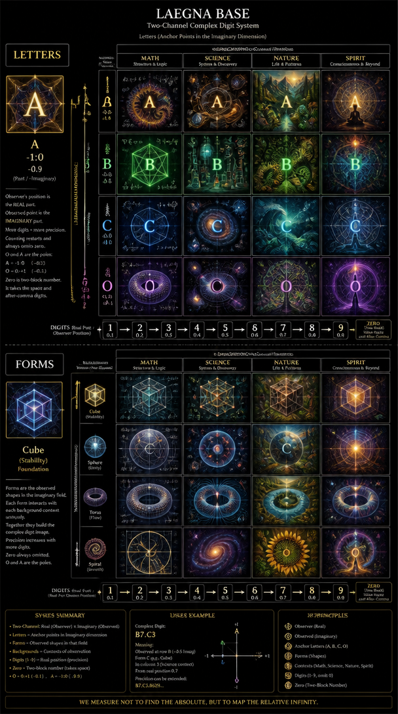

# Hex 16 Digit Cosmic Projection

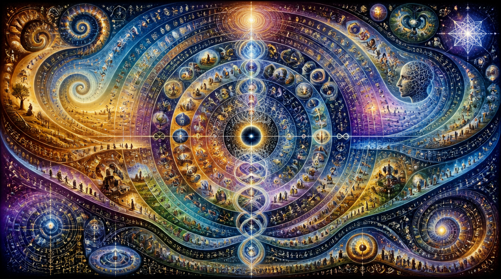

# Next Chapters are initial gallery

# Laegna Number AI Calligraphy

Number digits can be represented in pixel fields, preferrably square fields here, to gain very high precision - digits are the accountable note, while pixels are the impression of it's depth and can be very precise when detail is paid attention.

# Introduction to Laegna Numbers

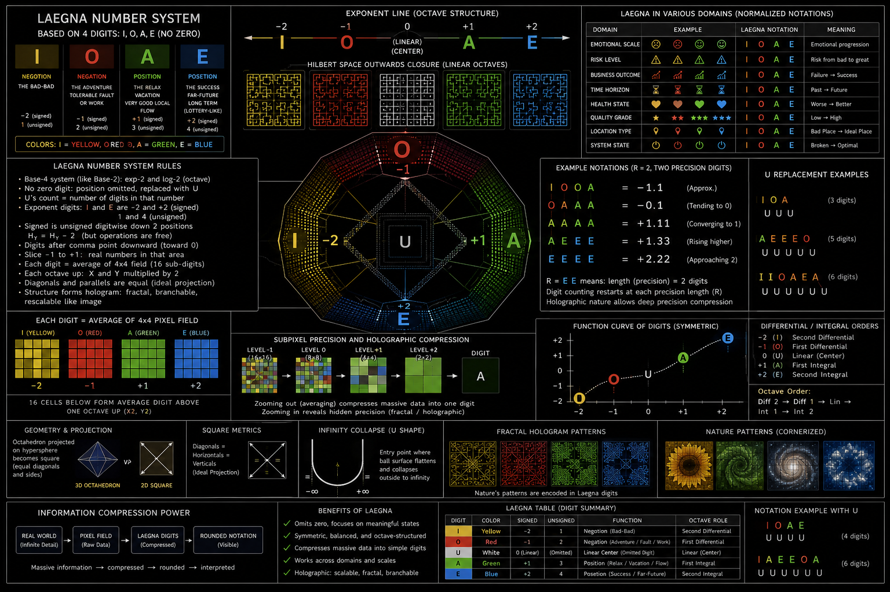

# LaeNum

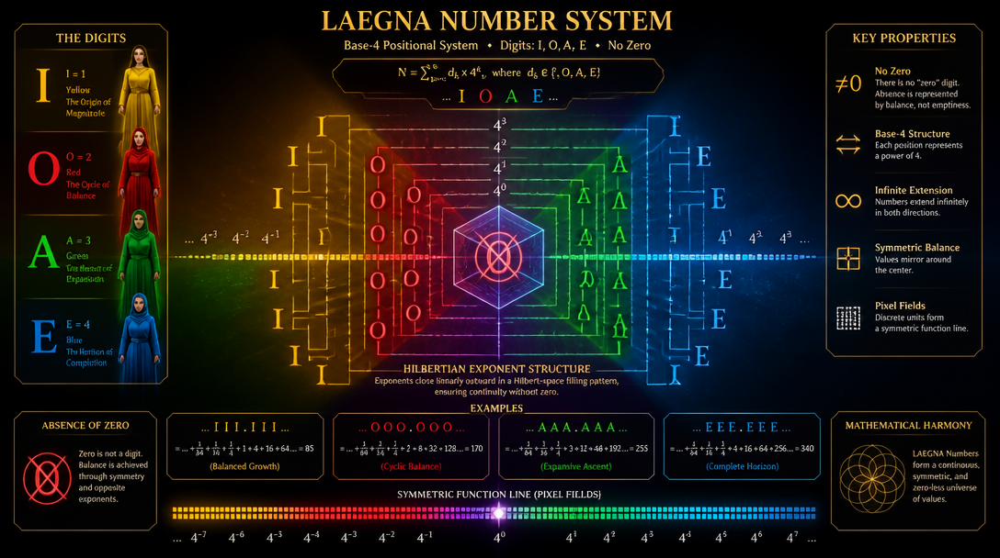

# Drawing

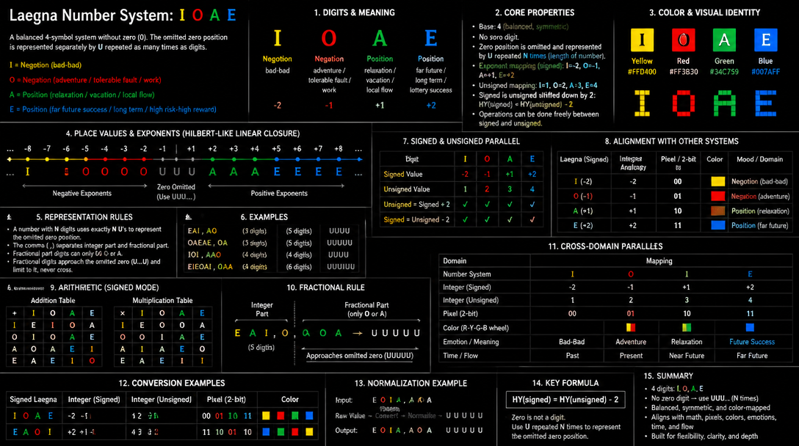

# DigitalDrawings

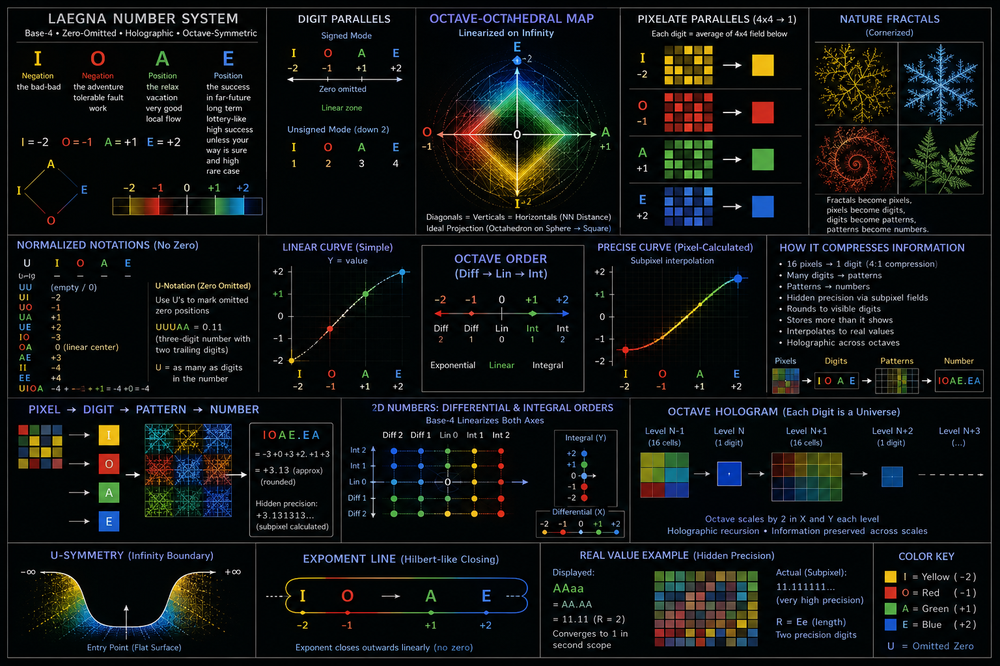

# Digit Spaces

## Square Digit Space

Averages of, for example 4\*4 square grid, form the numbers - Yellow I, Red O, Green A, Blue E:

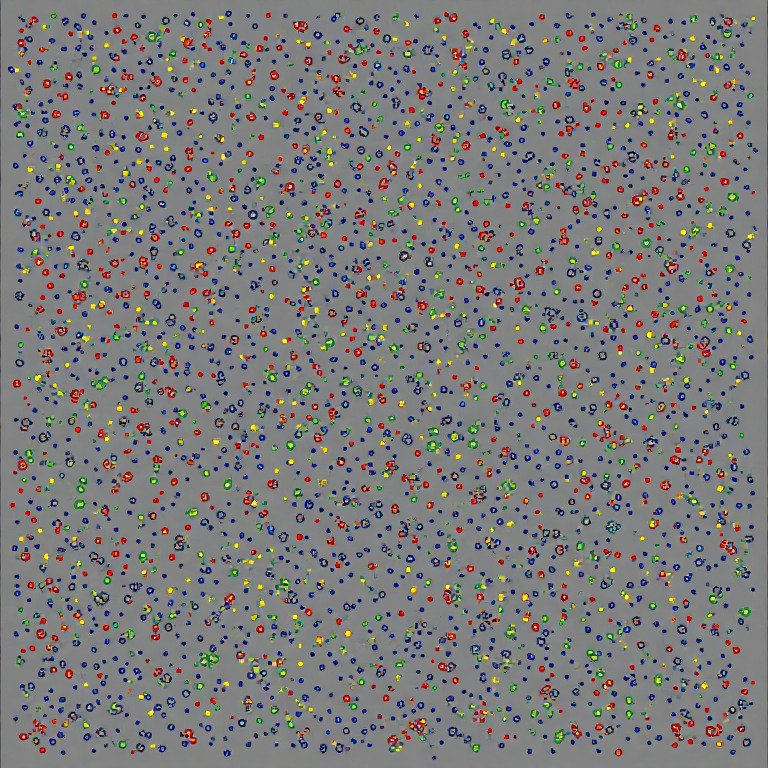

## Circle Digit Space

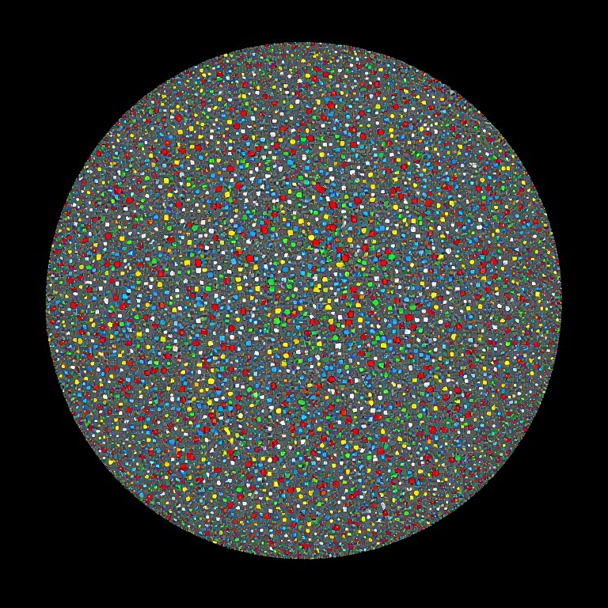

# Looks like QR

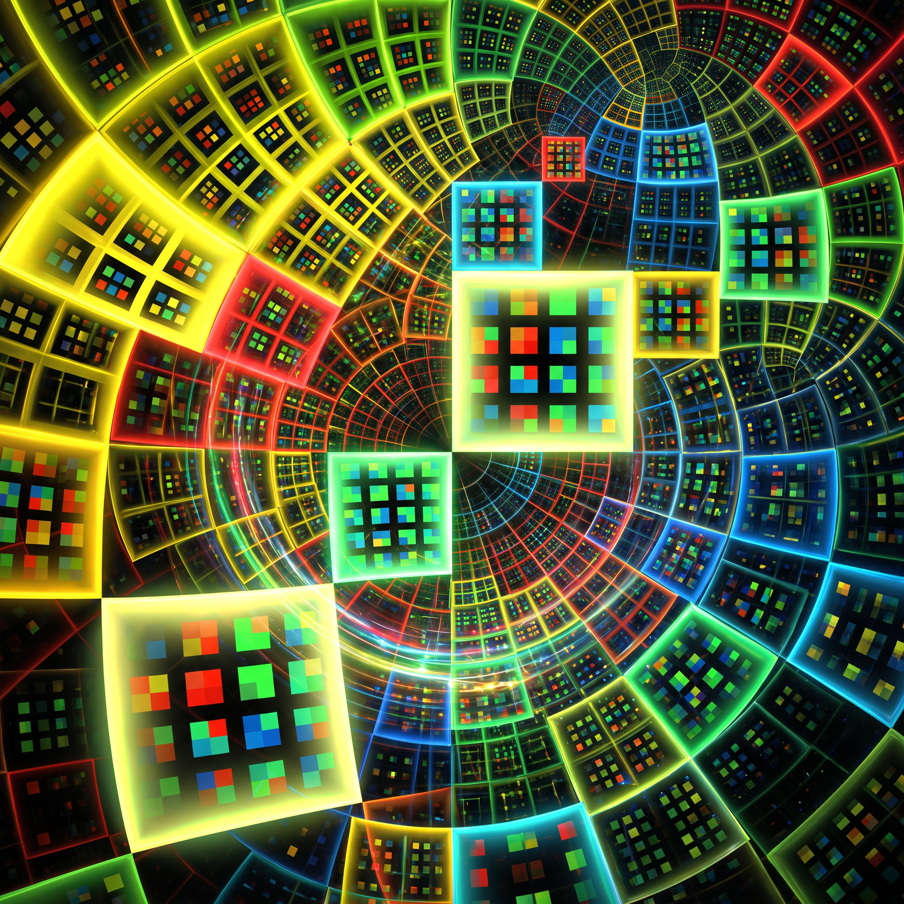

# EIOAE

# 2D Number Spaces

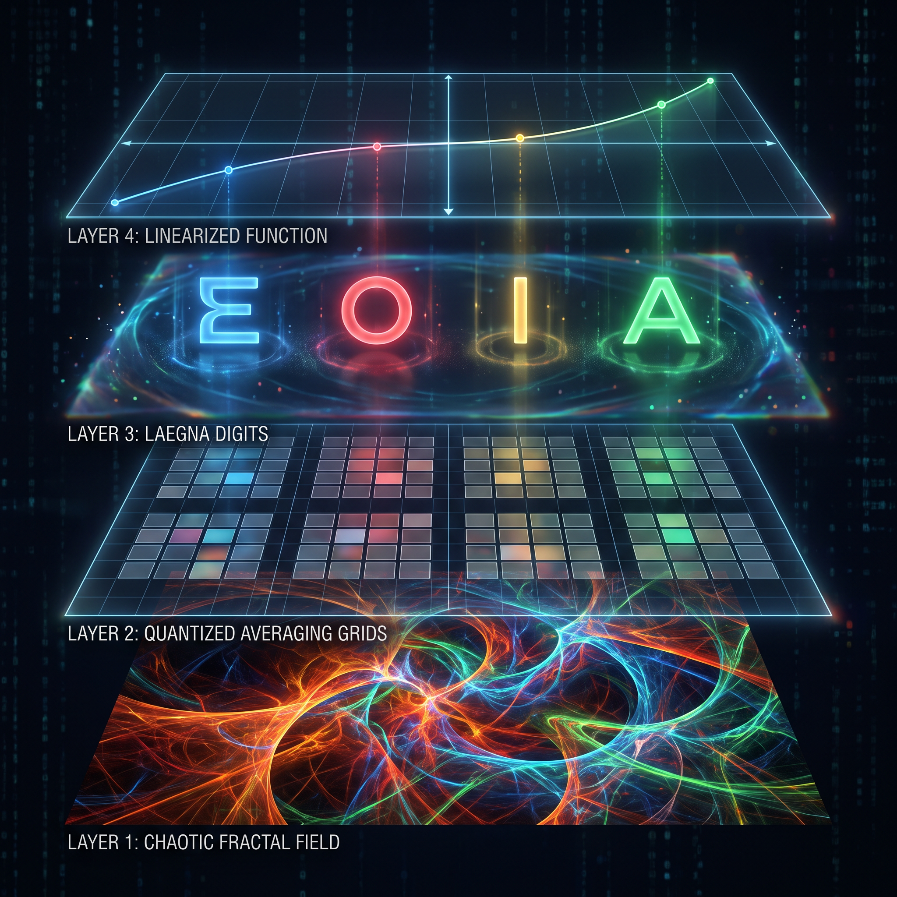

## Gaussian Curvature in 2D Number

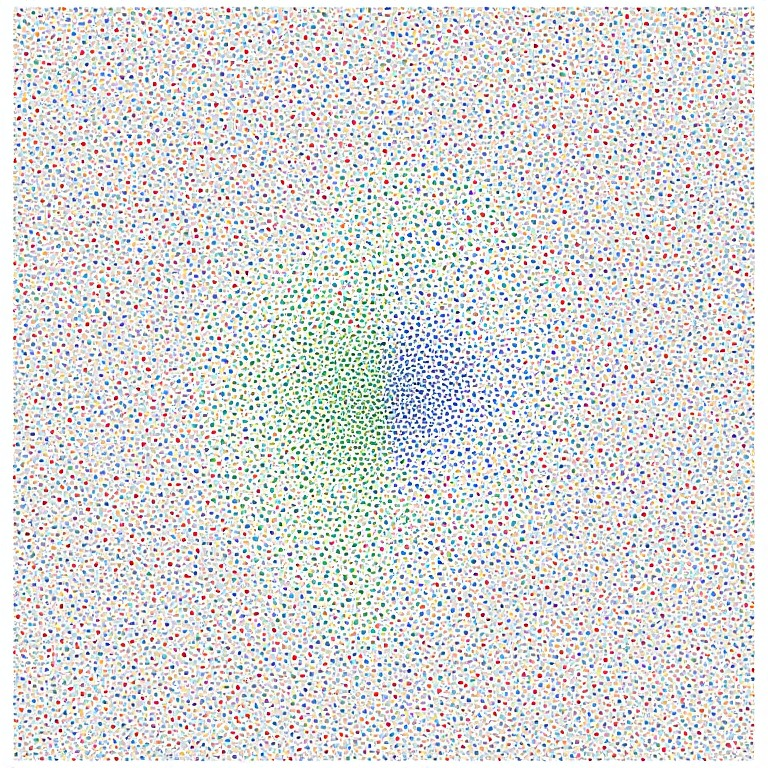

## Chaotic Attractors in 2D Number

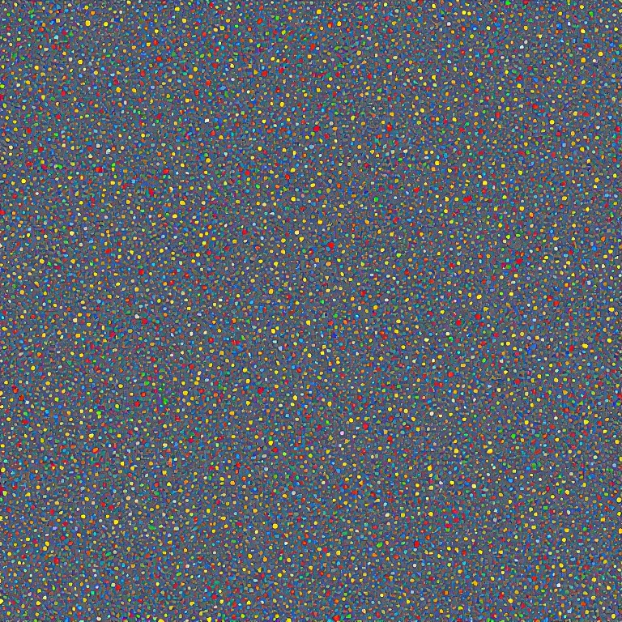

# Traveller in Single Number

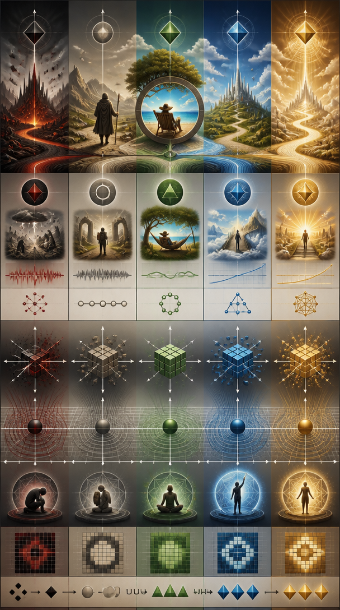
