Some conceptual, spiritual or math-aligned art on topic of octaves.

# Octave Linear

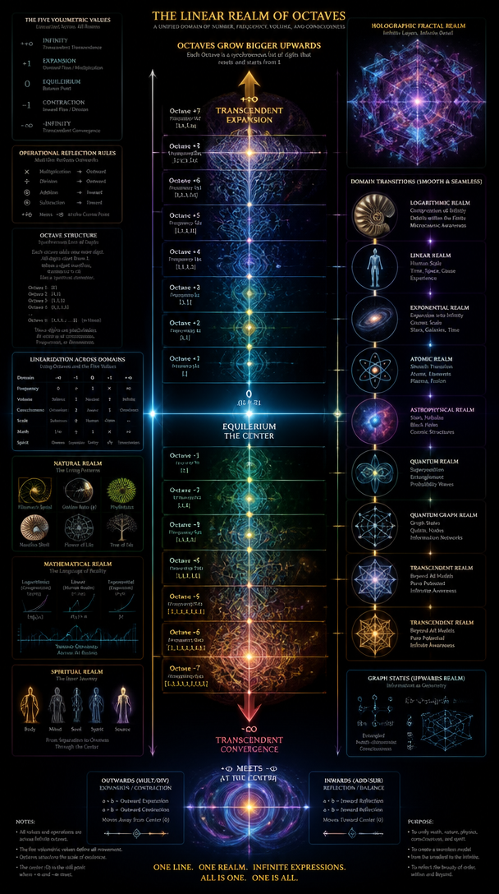

# Holo Realms

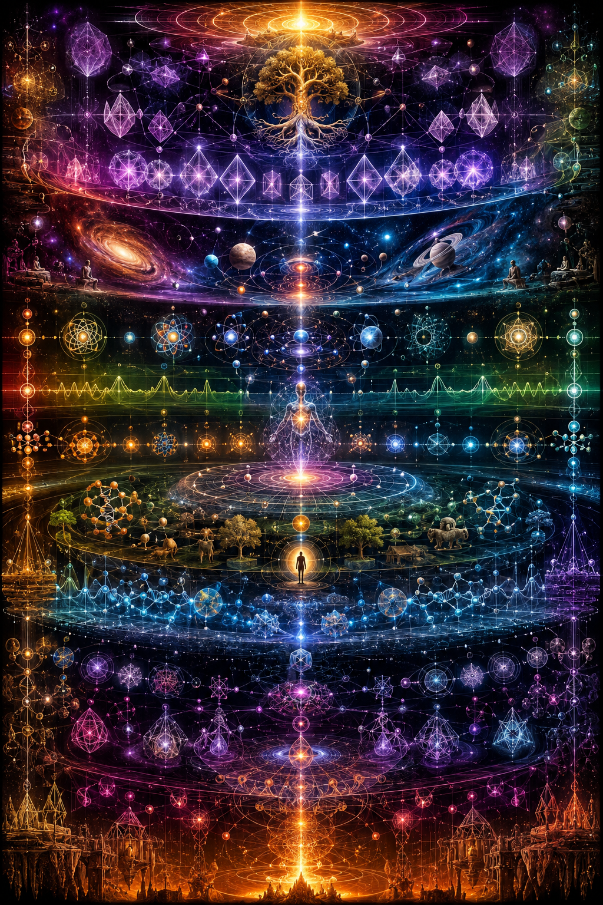

# Boddhisattva

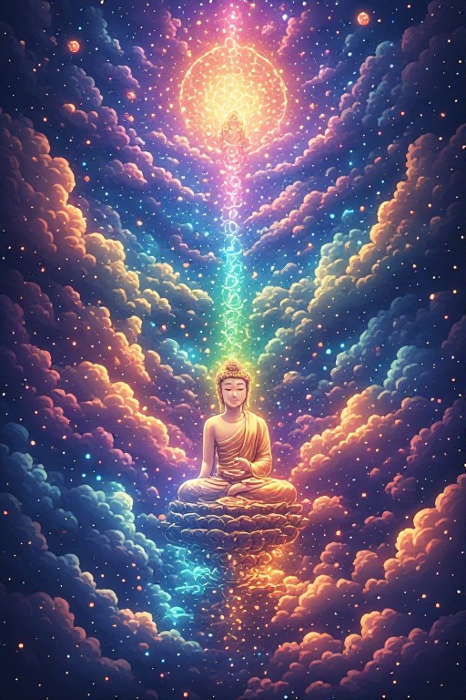

# Sky

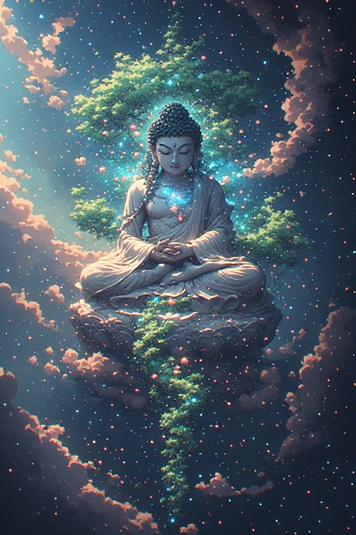

# Ruler of the World

# Deva

# Meditation

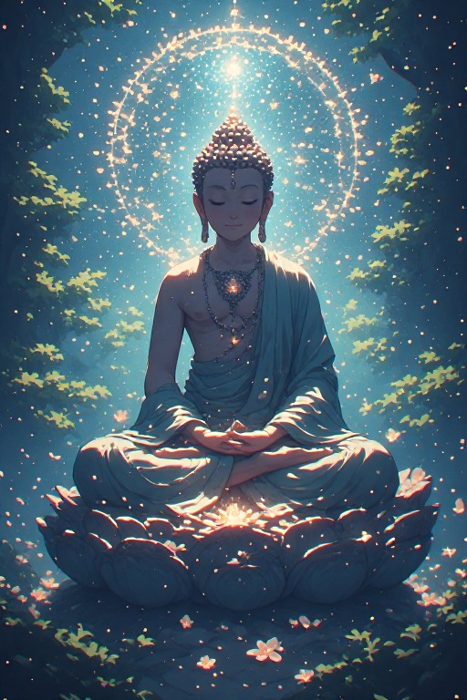

# Fantasy

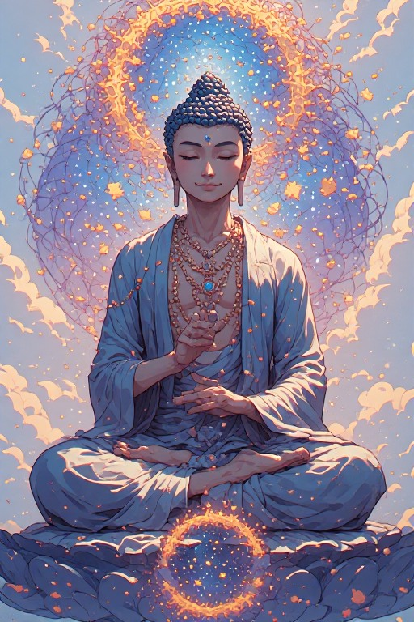

# Bubble Realm

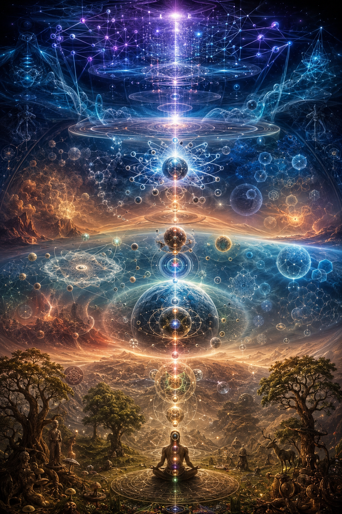

# Quarters

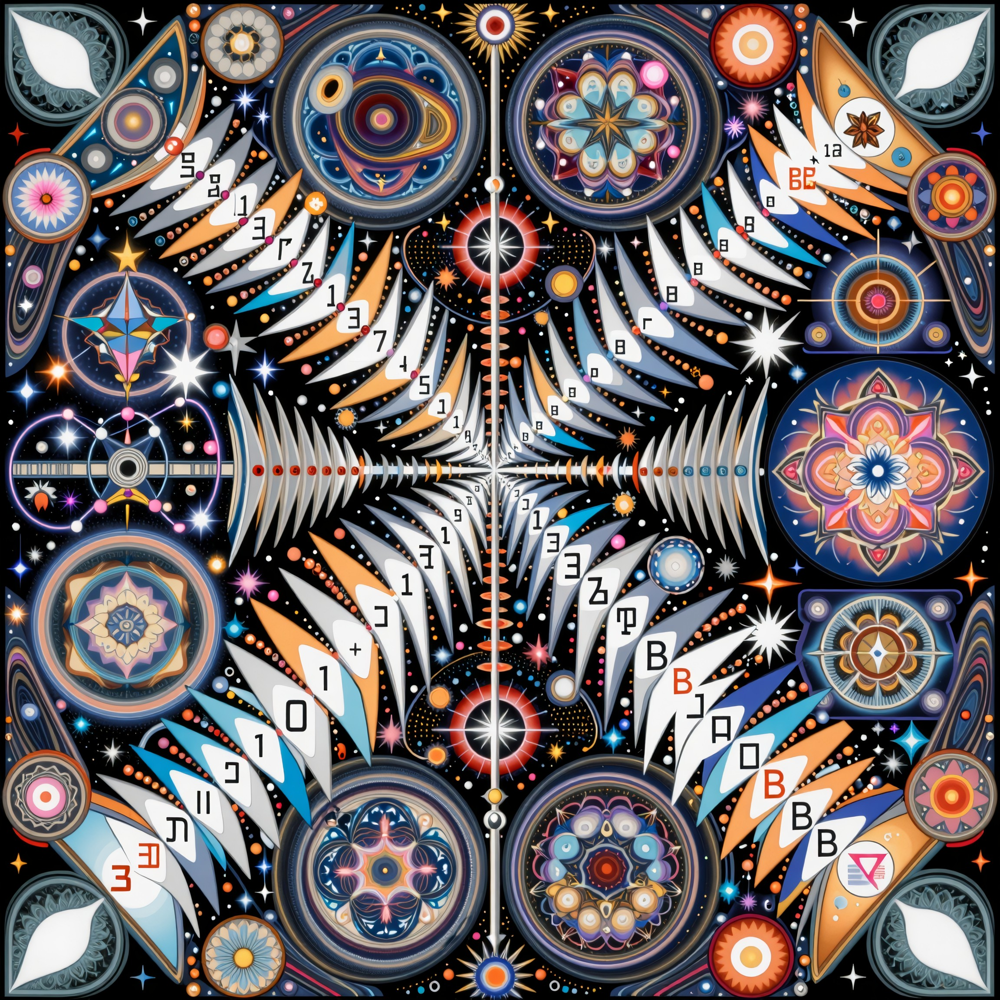

# Landscape Surrealism

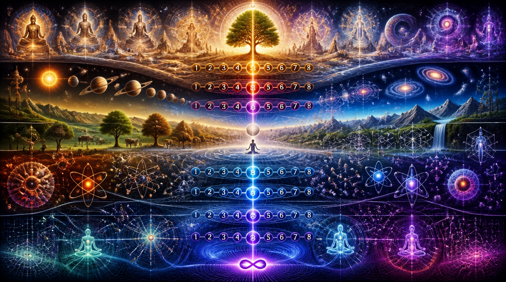

# Octave Tree

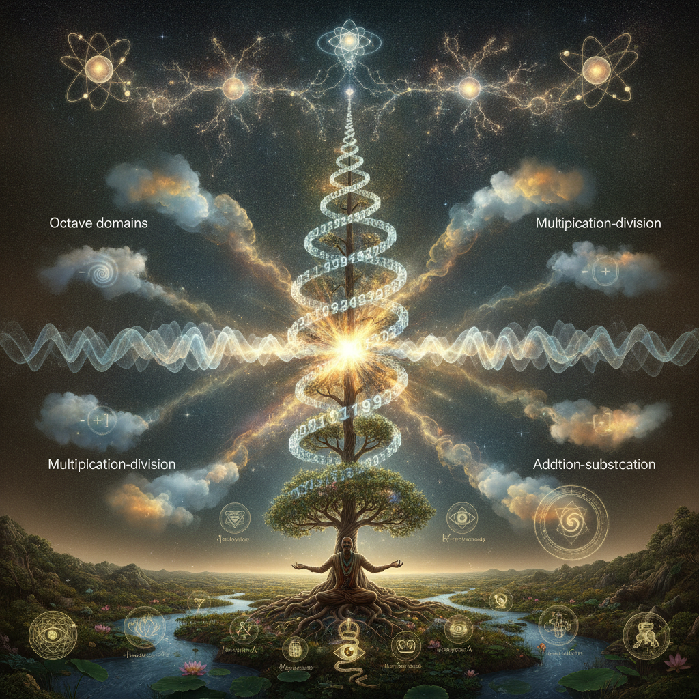

# Octivism

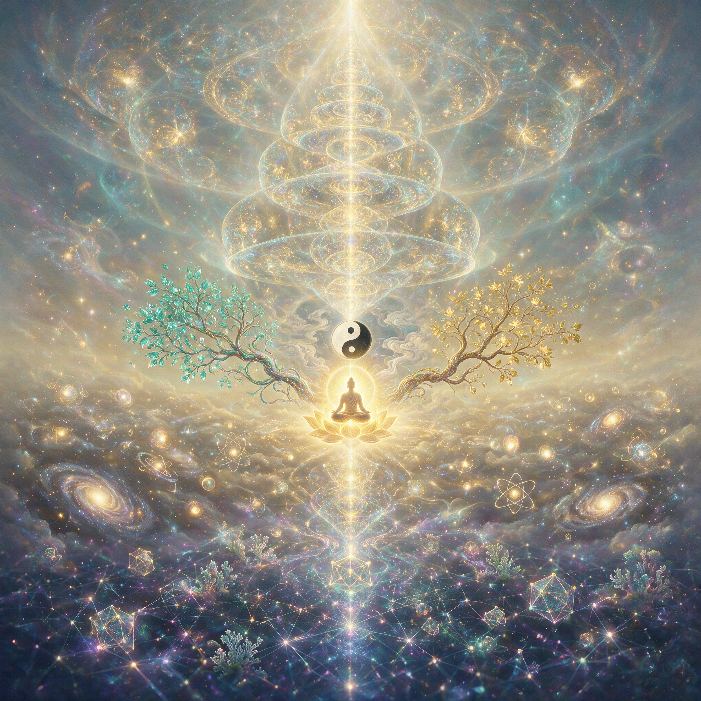
