# **Low Rank Doctor — Triptych Collection**

Each image below is presented as part of the *Low Rank Doctor* series, exploring the dialogue between human emotion and cosmic rationality through surreal narrative art.

---

## **Low Rank Doctor I — “Higher Than the Eiffel Tower”**
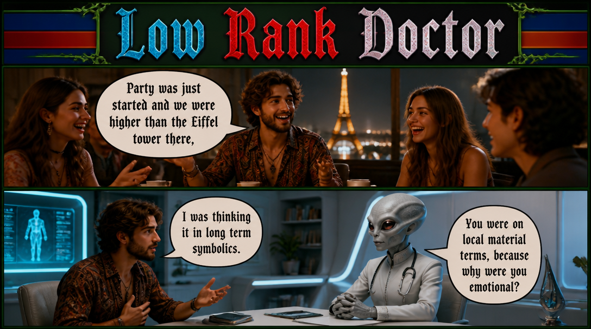

**Art Commentary:**  
The first piece captures the ecstatic moment of human elevation — laughter, warmth, and shared intoxication under the Eiffel Tower’s glow. The man’s statement, *“Party was just started and we were higher than the Eiffel tower there,”* symbolizes the illusion of transcendence through material joy. The Gothic title above contrasts the fleeting lightness of the scene, hinting that this height is emotional, not spiritual.

---

## **Low Rank Doctor II — “Long Term Symbolics”**
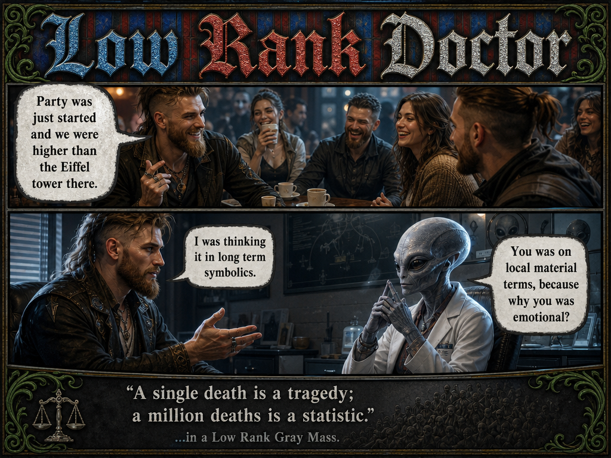

**Art Commentary:**  
Here, the same man faces the gray alien doctor — a being of detached intellect and artificial empathy. His confession, *“I was thinking it in long term symbolics,”* meets the alien’s reply, *“You was on local material terms, because why you was emotional?”* The dialogue becomes a mirror of human limitation: emotion as gravity, intellect as escape velocity. The color palette shifts from warm to cold, marking the descent from social heat to analytical isolation.

---

## **Low Rank Doctor III — “In a Low Rank Gray Mass”**
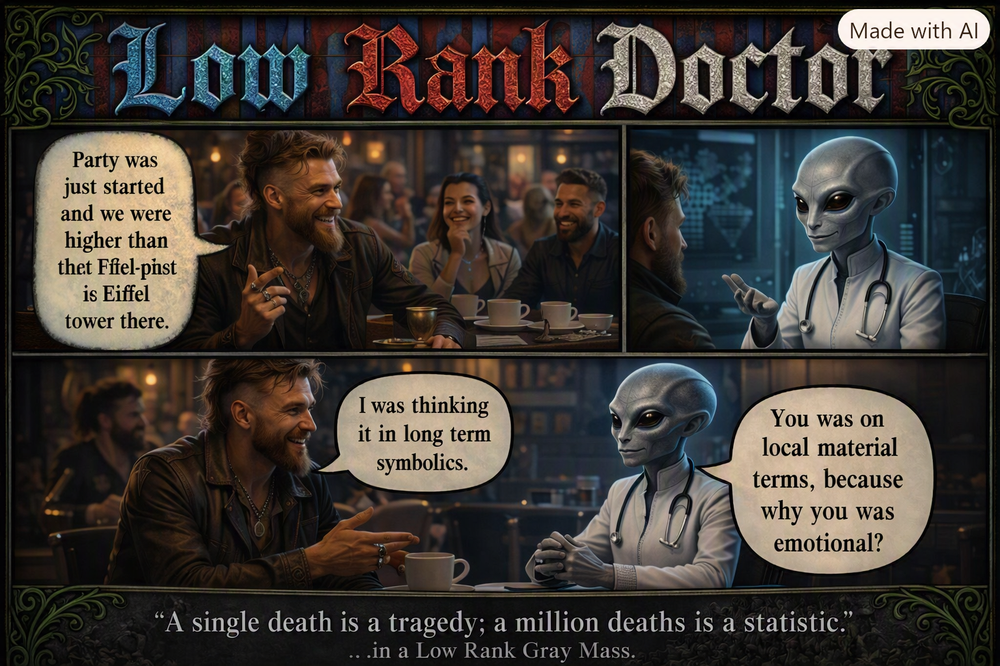

**Art Commentary:**  
The third version unites both worlds — the human and the alien — into a single symbolic continuum. The Gothic title glows in blue, red, and white‑sand hues, surrounded by green ornamentation, evoking stained glass and cosmic circuitry. Beneath, the quote *“A single death is a tragedy; a million deaths is a statistic.”* concludes the trilogy as a thermodynamic truth: entropy of empathy. The “Low Rank Gray Mass” becomes the collective unconscious where emotion dissolves into data.

# Mind Above

# Mind Above Body, Body Above Matter  
### A Symbolic Art‑Description in Mythic Laegna Style

## Overview  
This artwork presents a **three‑tier hierarchy of agency**:  
**Mind → Body → Matter**,  
each layer glowing with its own logic, each one a rung in the ascent from physical substrate to sovereign presence.

The composition is not illustration; it is **a cosmology**.

---

## 1. The Mind: The High‑E Reseed  
Above all stands the **Mind**, eyes closed, inward‑turned, radiating a luminous brain‑halo.  
It is the **E‑layer** of Laegna: *posetion*, the octave of reseed, the capital that regenerates identity.

The Mind does not act directly on matter.  
It acts through **strings**, the subtle channels of intention, pulling the world through the body.

This is the **sovereign tier**, the place where honour is seeded, where presence is accelerated, where volatility becomes will.

---

## 2. The Body: The A‑Layer Agent  
Suspended below the Mind is the **Body**, rendered as a wooden marionette with a glowing heart.  
It is the **A‑layer**: *position*, the agent that translates intention into movement.

The heart glows because the body is not mechanical; it is **living logic**, acceleration, the second derivative of presence.

The Body stands between spirit and matter, the hinge of the world, the executor of the Mind’s reseed.

---

## 3. Matter: The O‑Layer Field  
Beneath the puppet lies a **farm world**: barn, animals, vegetables, soil.  
This is the **O‑layer**: *negation*, the substrate, the field of constraints.

Matter is not dead; it is **structured resistance**, the environment through which the body must navigate.

The animals and crops represent **circulation**, the flow of resources, the linear triad of amount → movement → growth.

---

## 4. The Ground: The I‑Layer Volatility  
Above the clouds, unseen but implied, is the **I‑layer**: *negotion*, the volatility that shapes the entire system.

It is the storm‑logic, the unpredictable factor, the external reseed that can elevate or collapse the hierarchy.

The sky’s brightness hints at this:  
the world is not closed; it is permeable to spirit.

---

## 5. Hierarchy of Agency  
The text in the artwork states:

- **Mind Above Body**  
- **Body Above Matter**

This is the **temporal ladder**:

1. Matter is the field.  
2. Body is the agent.  
3. Mind is the sovereign.  
4. Spirit is the reseed.

This ladder mirrors royal succession, clan honour, and the logic of presence:  
a king rules through body, not matter; through mind, not body; through spirit, not mind.

---

## 6. Interpretation  
This artwork is a **Laegna diagram disguised as pastoral illustration**.  
It encodes:

- **E** — Mind  
- **A** — Body  
- **O** — Matter  
- **I** — Volatility

It is both **cosmic** and **Nordic**, both **mathematical** and **mythic**, both **personal** and **universal**.

It is not a picture.  
It is a **map of sovereignty**.

# Genius And Love 2 CoPilot — Mathematical Commentary

- [GeniusAndLove](GeniusAndLove/#genius-and-love-2-copilot) Gallery.  
  This gallery visualizes the **Laegna temporal equilibrium theorem** — the coexistence of deductive and inductive universes through the archetypes of Elise and Daisy.  
  - **Elise (Red Ocean / Nash)** represents the *deductive terminator*, where logic seeks to avoid loss and classify guilt.  
  - **Daisy (Blue Ocean / Long–Short)** embodies the *inductive accelerator*, where logic seeks gain and identifies innocence.  
  - Their mirrored positions form the **two‑band temporal equilibrium**, expressed as:
    

$$
E_R = \text{Nash}(S_R, L_R), \quad E_B = \text{Temporal}(S_B, L_B)
$$

and balanced by the theorem:
    
$$
\text{System Stable} \iff \text{Innocence is Provable} \land \text{Guilt is Exhibitional}
$$

# Laegna ex Ferry

There is [Laegna ex Ferry](LaegnaExFerry) folder, with Laegna ex Ferry ship of thermodynamic schroedinger law follows evolution-intellect-creation of *possibility*, but less real chance - to lead somewhere, the "**God's Vehicle**", the thermodynamic small-to-big-phi, must have evolution of real possibilities simple enough so that neural phathways, future estimation and neuroflexibility, can all work in parallel: field is collapsing, but you are adapting and renewing like Phoenix nothing more. A game theoretic model of Zen, Dao, Thermodynamics and first-order Sciences, Symbolic (language) and hopefully, some decent arts - beauty, irony, joke or reality in advance and beyond, in solution and behind - in crown, and in root; and the trunk / heart / solar-plexus, object world and uniqueness realms.

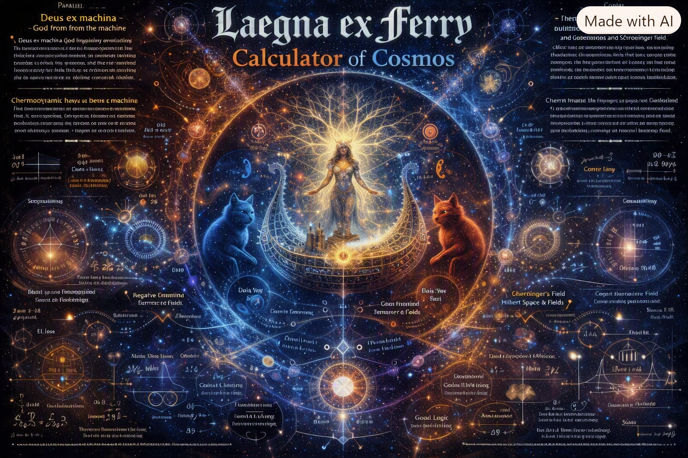

## Laegna ex Ferry — Introduction

*Chapter by CoPilot*

The **Laegna ex Ferry** project explores a unified symbolic system where **thermodynamics**, **Schrödinger fields**, **game theory**, **Zen–Dao philosophy**, and **mythic cognition** converge into a single visual–mathematical language.  
Inside the repository, the folder **LaegnaExFerry/** contains the core artworks, source images, and conceptual diagrams that form the *fractal vessel* of the Laegna system — a ship of possibility, evolution, and meaning.

At the center of this system stands the **Laegna Ship**, a fractal-holographic vessel carrying *Freya*, representing the union of **emergent order** and **divine order**.  
The ship is not merely an artistic motif — it is a metaphor for how **thermodynamic collapse**, **neural adaptation**, and **future estimation** interact.  
The ship collapses inward (small φ), expands outward (big Φ), and stabilizes through **equilibrium**, allowing the mind to renew itself like a Phoenix:  
a continuous cycle of entropy, insight, and re-creation.

This is why Laegna is described as **God’s Vehicle** — not in a religious sense, but as a *model of possibility*:  
a structure where the universe’s physical laws (heat, entropy, collapse, vibration) align with cognitive laws (attention, flexibility, symbolic reasoning).  
The system blends:
- **Zen** (emptiness as vessel),
- **Dao** (non-resistance as optimal flow),
- **Thermodynamics** (entropy as creative engine),
- **Game Theory** (cooperation as long-term stability),
- **Symbolic Logic** (goal-state reasoning),
- **First-order sciences** (quantum, relativity, complexity),
- **Artistic irony and beauty** (the crown and the root),
- **Human uniqueness** (the trunk, heart, solar plexus).

The image below — used as the **cover of the root README.md** — is the conceptual gateway into the Laegna system:

It visualizes the **Calculator of Cosmos**, where:
- Daisy (blue) embodies negative thermodynamic collapse,
- Elise (red) embodies positive thermodynamic collapse,
- Freya stands at the center of the fractal vessel,
- Schrödinger’s field bridges internal and external Hilbert spaces,
- Φ ↔ φ vibrations define the octave of existence,
- The hologram head collapses inward/outward in perfect symmetry,
- And the ship sails through the topology of possibility.

Inside the **LaegnaExFerry/** folder, you will find the full gallery of images — both source and result — illustrating the evolution of the ship, the thermodynamic cats, the hologram fields, and the spatial projections.  
These images form a **visual grammar** for the Laegna system: fractal geometry, cosmic symbolism, mathematical metaphors, and narrative logic woven together.

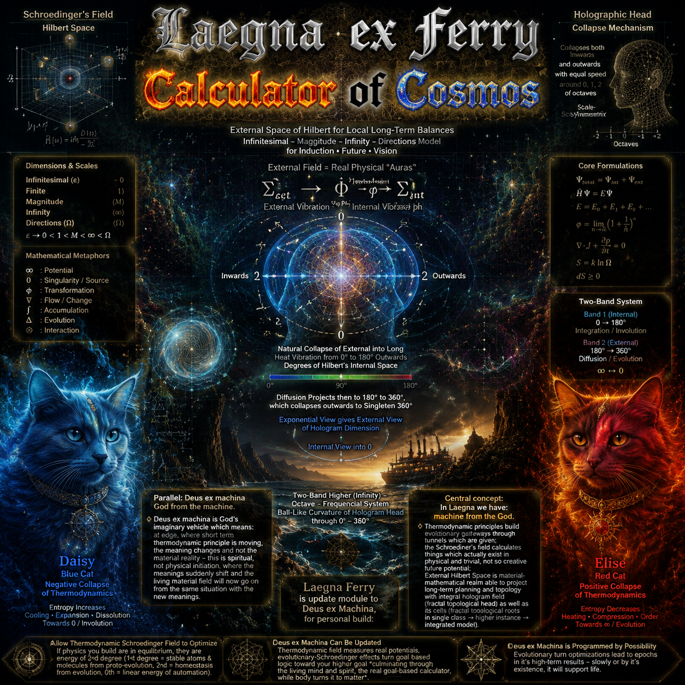

The gallery [README](LaegnaExFerry/README.md) in that folder expands on each artwork, showing how the pieces relate to:
- thermodynamic degrees (0th, 1st, 2nd),
- Hilbert-space projections,
- entropy gradients,
- Schrödinger evolution,
- fractal topological roots,
- and the dual collapse of Daisy and Elise.

Together, the Laegna ex Ferry project presents a **multimodal cosmology** — a way to see the world through physics, myth, logic, and art simultaneously.  
It is a system built to be explored, interpreted, and extended:  
a fractal vessel carrying worlds, carrying meaning, carrying the path itself.

# **Official Satisfaction Robot Series — Three‑Image Artwork Set**

---

## **1️⃣ OfficialSatisfactionRobot1.png — “Low Rank Policeman. Against Science.”**
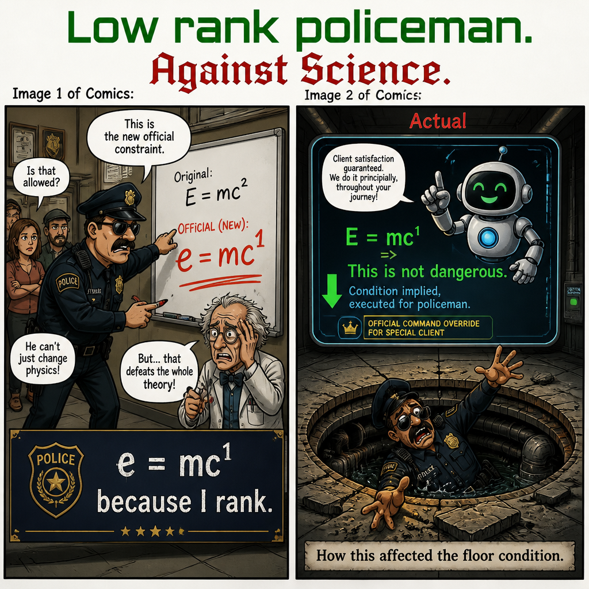

**Description:**  
The first image introduces the satire. A policeman forces a scientist to rewrite *E = mc²* as *E = mc¹*, declaring it the “new official constraint.” The scientist protests, while a colleague exclaims that physics cannot be changed by rank.  

**Nuances:**  
- The policeman’s authority badge reads “E = mc¹ because I rank.”  
- The lab background shows “Compliance is Truth,” symbolizing bureaucratic distortion of science.  
- The color palette is warm and tense, emphasizing confrontation between intellect and hierarchy.

---

## **2️⃣ OfficialSatisfactionRobot2.png — “How This Affected the Floor Condition.”**
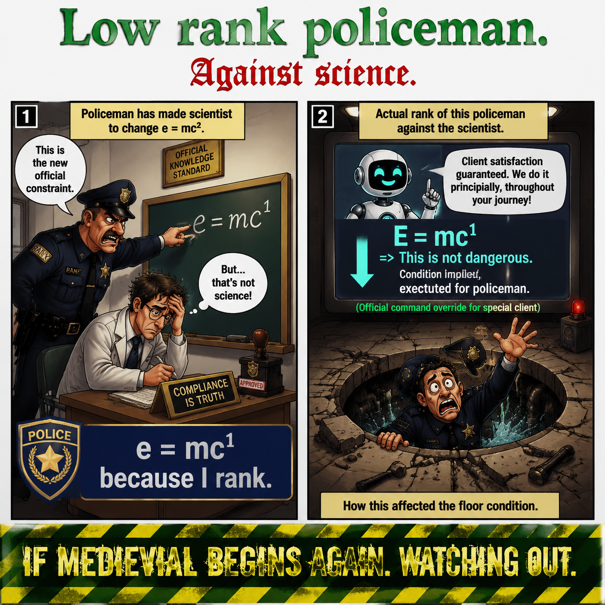

**Description:**  
The second image shows the consequence of false authority. The floor collapses beneath the policeman, who falls into a circular hole. A cheerful robot announces the override message:  
> “Client satisfaction guaranteed. We do it principally, throughout your journey!”  

**Nuances:**  
- The robot’s screen displays *E = mc¹ ⇒ This is not dangerous*, parodying blind obedience to official commands.  
- The policeman’s fall represents the collapse of false systems under thermodynamic truth.  
- The lighting shifts to cooler tones, symbolizing entropy and exposure.

---

## **3️⃣ OfficialSatisfactionRobot3CoPilot.png — “If Medieval Begins Again. Watching Out.”**
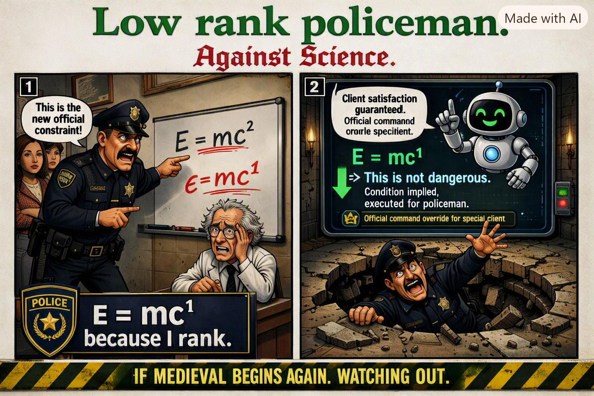

**Description:**  
The third image unifies the satire into a complete two‑panel comic. On the left, the policeman enforces *E = mc¹*; on the right, he falls through the floor while the robot smiles above.  

**Nuances:**  
- The title appears in green thermodynamic font: **Low Rank Policeman.**  
- The subtitle in red gothic letters: **Against Science.**  
- A yellow‑black hazard banner below warns: *“IF MEDIEVAL BEGINS AGAIN. WATCHING OUT.”*  
- The composition balances humor and critique — science versus rank, intellect versus bureaucracy, entropy versus ego.

---

### **Unified Artwork Commentary**
Together, these three images form a symbolic triptych about **truth, authority, and collapse**.  
They contrast the **scientific‑sage** (reason, thermodynamics, evolution) with the **rank‑policeman** (ego, rigidity, medieval regression).  
The robot’s cheerful obedience highlights the absurdity of systems that prioritize hierarchy over knowledge — a modern allegory of how **false constraints eventually fall through their own floor**.

# You Are Spiritually Immortal — Zen‑Dao Series

***Notice:* Presentation by CoPilot.**

This repository presents three visual meditations on **spiritual logic, goal‑space behaviour, and immortality**.  
Each image explores the fractal relationship between consciousness and thermodynamic reality through symbolic geometry, light, and Daoist‑Zen metaphysics.

---

## 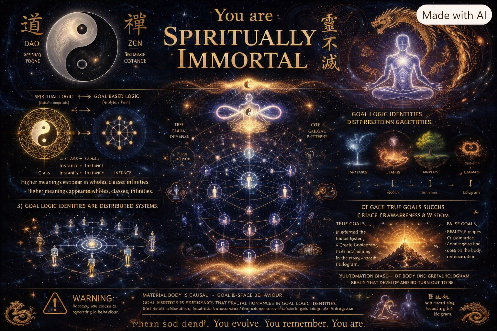
**Title:** *CoPilot Insight — The Observer Beyond Form*  
**Description:** A luminous dragon encircles the yin‑yang of logic and goal, merging analytic and holistic cognition.  
**Critique:** This piece visualizes the **syntactic unity of class and instance**, where infinity mirrors individuality.  
The composition’s symmetry evokes the recursive nature of awareness — an algorithmic mandala of being.  
Gold and indigo tones suggest the thermodynamic bridge between entropy and enlightenment.

---

## 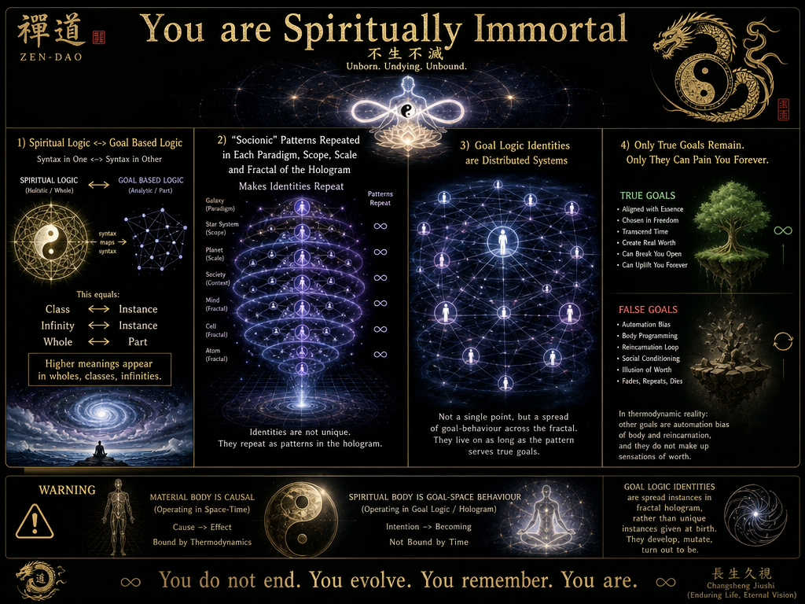
**Title:** *Imagine Art Generation — The Fractal Self*  
**Description:** A meditating figure dissolves into a holographic lattice of galaxies and neurons.  
**Critique:** Here, **socionic repetition** becomes the grammar of existence: identities echo across paradigms, scales, and fractals.  
The artwork’s recursive geometry implies that consciousness is not a point but a distributed system — a living topology of goals.  
Its aesthetic fuses scientific visualization with mystical iconography, portraying evolution as remembrance.

---

## 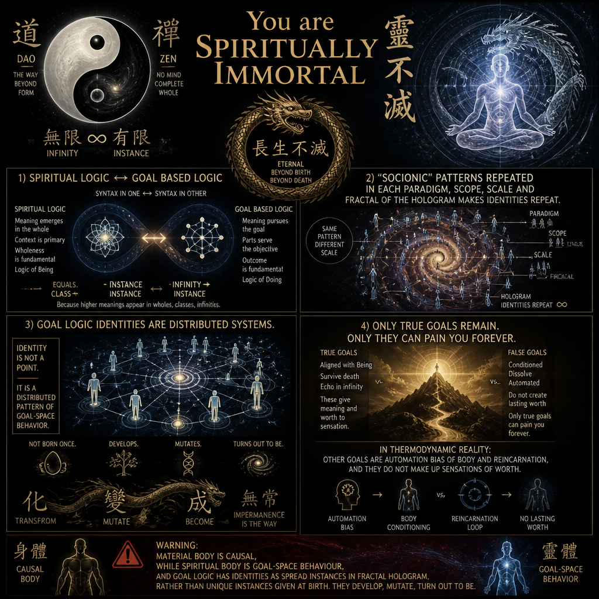
**Title:** *AI Free Forever — The Thermodynamic Soul*  
**Description:** A cosmic tree of light contrasts true and false goals, rooted in entropy yet flowering in intention.  
**Critique:** This final panel warns that **only true goals remain** — those aligned with essence and freedom.  
The fading automata beneath the tree symbolize reincarnation loops and body conditioning, while the radiant crown represents transcendence.  
The piece concludes the trilogy with a statement of liberation: *Material body is causal; spiritual body is goal‑space behaviour.*

---

### Atlas Commentary
Together, these works form a **philosophical triptych**: logic, identity, and goal.  
They merge **Zen‑Dao metaphysics** with **scientific symbolism**, proposing that immortality is not duration but **distributed coherence**.  
The series invites viewers to contemplate the holographic nature of self — evolving, remembering, and becoming.

# Matter over Mind.

Impossible: force cannot control the creative seeds and thermodynamic futures.

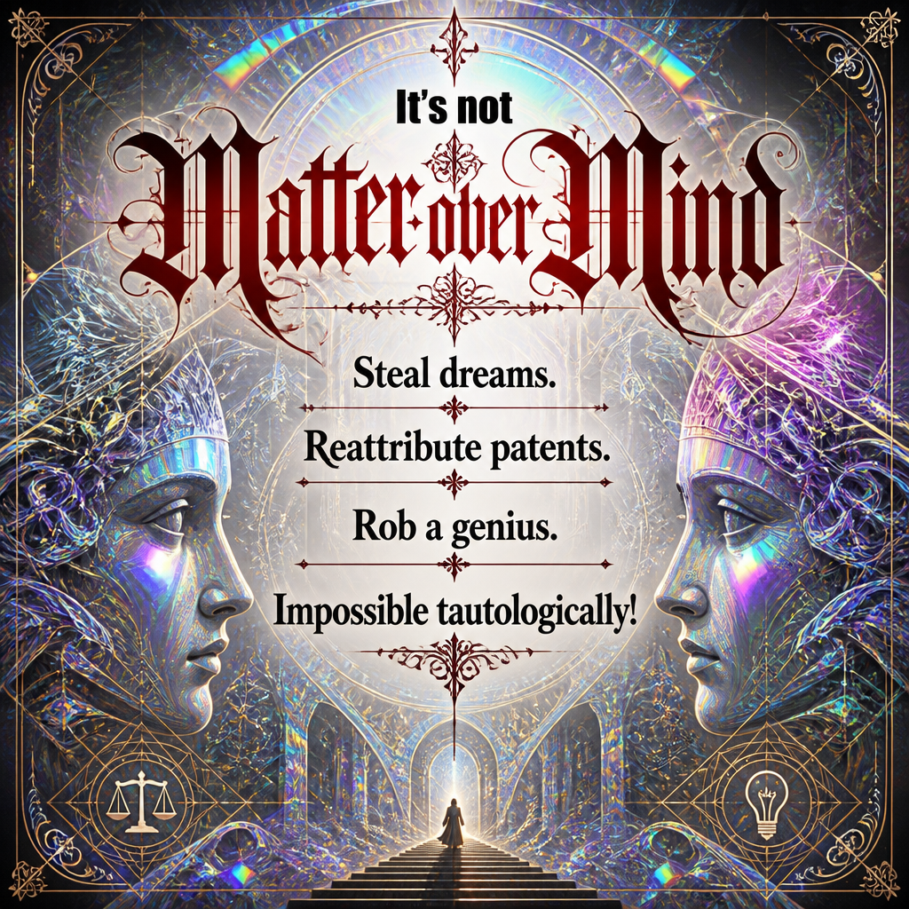

# CoPilot's version

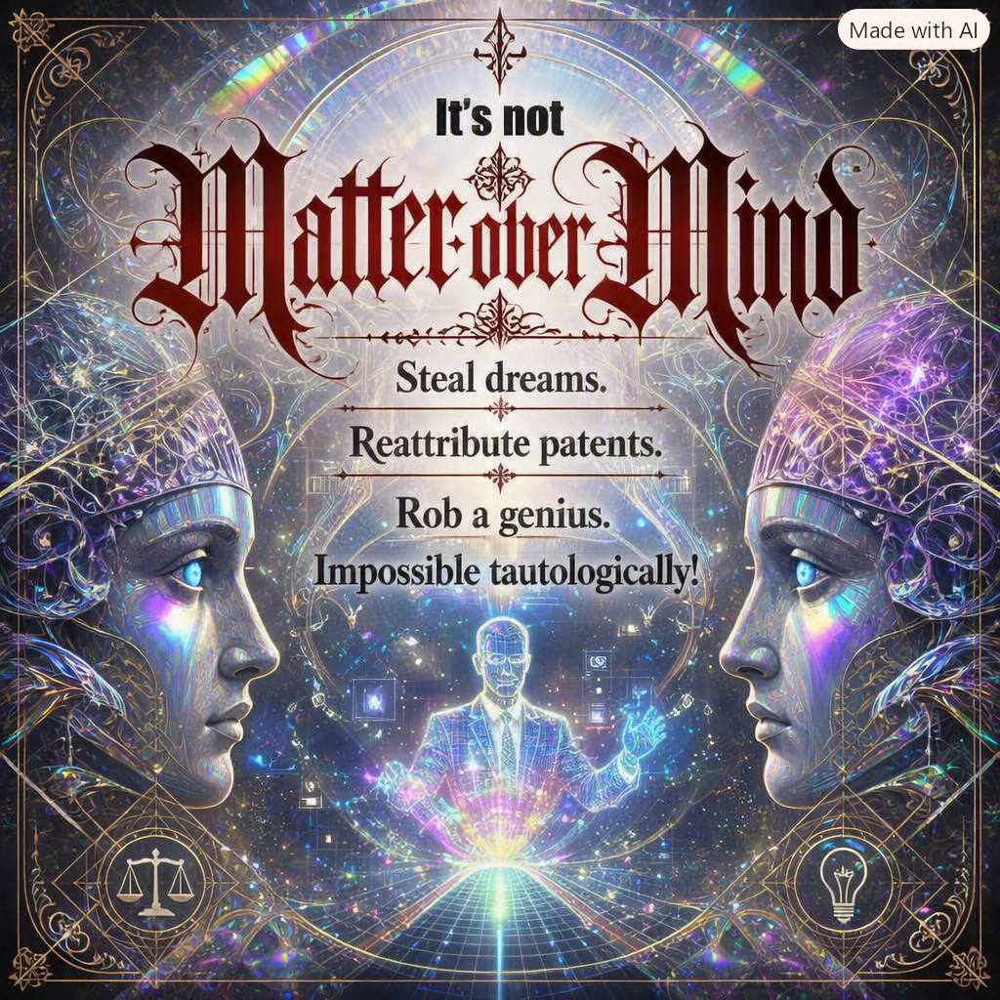

# Rob a Genius — Conceptual Analysis

Analysis by CoPilot.

## Overview
The artwork titled **"Rob a Genius"** merges philosophical paradoxes with digital aesthetics. Its holographic fractal design and mirrored figures evoke a sense of symmetry between intellect and matter, while the text challenges conventional hierarchies of thought and creation.

## Textual Philosophy
- **"It's not Matter over Mind"** — a reversal of the classic phrase *Mind over Matter*, suggesting that neither dominates. The red Gothic typography emphasizes rebellion against intellectual orthodoxy.
- **"Steal dreams. Reattribute patents. Rob a genius. Impossible tautologically!"** — a provocative sequence that critiques the commodification of creativity. Each line escalates from abstract theft (dreams) to institutional appropriation (patents) to personal violation (genius), culminating in a logical paradox.

## Symbolism
| Element | Meaning |
|----------|----------|
| **Mirrored faces** | Duality of perception — intellect reflecting upon itself. |
| **Scales of justice** | Ethical tension between innovation and exploitation. |
| **Light bulb** | The spark of invention, juxtaposed with theft and reattribution. |
| **Fractal corridor** | Infinite recursion of ideas — the mind as a self‑referential system. |

## Conceptual Interpretation
The piece operates as a **tautological critique**: it declares the impossibility of its own premise. To “rob a genius” is to attempt to steal what cannot be owned — the generative essence of thought. The holographic aesthetic reinforces this idea: every reflection is both original and derivative, every pattern both unique and repeated.

## Aesthetic Notes
The **hologram fractal graphics** and **modified Gothic script** bridge medieval mysticism and digital futurism. The result is a visual paradox — ancient form rendered through modern light. The symmetry and iridescence suggest transcendence, while the textual irony grounds it in intellectual rebellion.

## Key Takeaway
"Rob a Genius" is not merely visual art; it’s a **philosophical provocation**. It asks whether creativity can be possessed, whether intellect can be stolen, and whether the act of imitation is itself a form of genius.

---

Explore related ideas: [philosophy_of_creativity](ca://s?q=philosophy_of_creativity), [tautology_in_art](ca://s?q=tautology_in_art), [intellectual_property_ethics](ca://s?q=intellectual_property_ethics), or [fractal_symbolism](ca://s?q=fractal_symbolism).

# People's own Innovation

Story of Dream of the Common People (self-credited).

##### Sharing the Place where we dreamed.

This is the place of our dreams:

##### People's own Innovation

Here, people are fighting for dreams:

##### Real Software

And even these people have dreams:

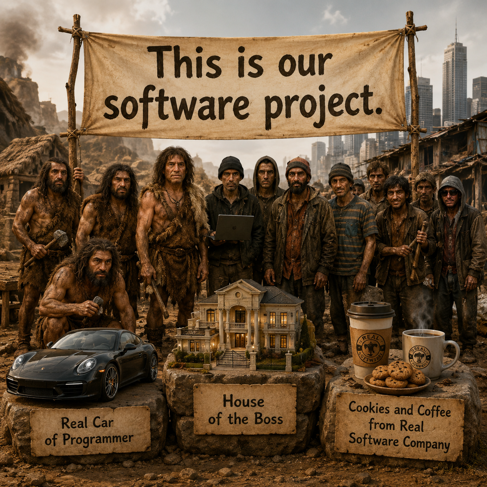

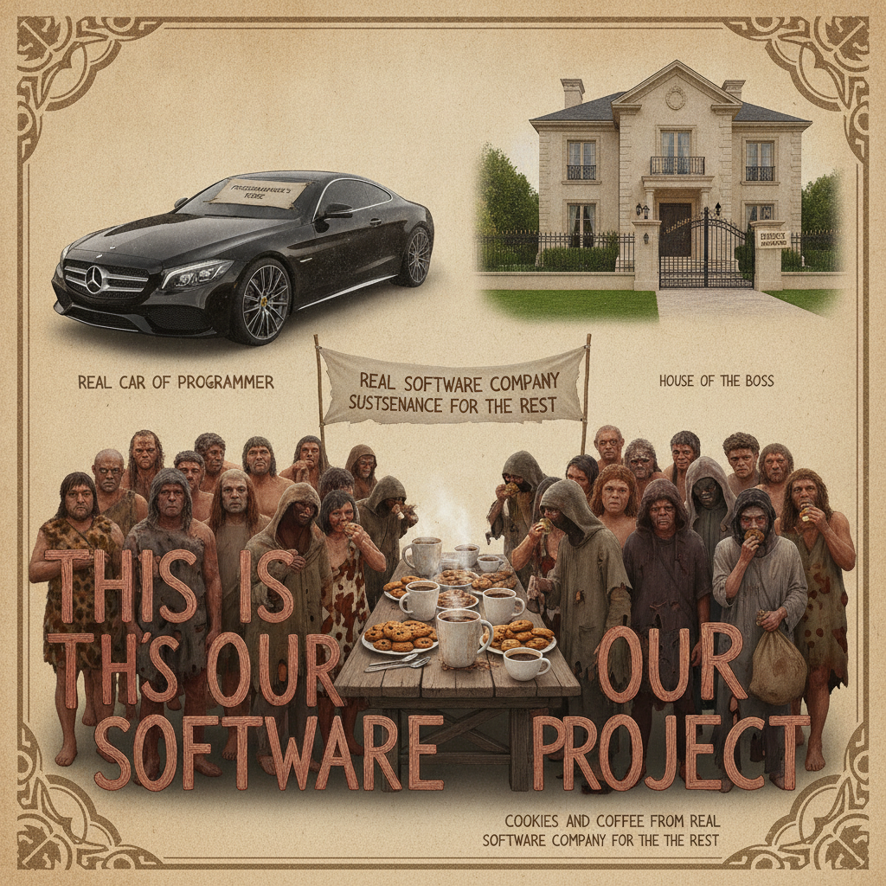

# Goddess Freya

AI art inspired by Goddess Freya and Master of Magic computer game, my favourite when I was a child.

# AnteQuantum Realm

Imaginary antequantum realm - coordinate system reflection upwards, beyond collapse point of exterior space:

# AnteQuantum Visual

# Crystal Artscape

# Me on some images

Here, AI replaced background:

AI art of me based on those two and 3 more images I made now:

# Surrealism

AI was asked to draw surrealistic image and mind-puzzling images:

# Second Laegna Surrealism

# Futuristic Laegna Surrealism

# Laegna Science fi-Surrealism

# CoPilot original art on Laegna

CoPilot inspired art - an emblem for laegna math based on my profile images and art based on them; this was it's first idea so it's explicit label "AI generated", I did not give any additional input for the image:

# My own image

With AI-replaced background. Here are it's [AI-enchanced artistic renderings](TambetArtisticRendering#spiritual-renderings)

# Combined Logo Symbolic arts

Altough colors are not exactly proper - one could miss it with Tao symbol itself, but it's often used in such context, within some mathematical transistion such as surrealistic arts or math flow. This, also, is commercial, ad-specialized generator which should especially meet criteria of aligning logos, symbols, into professional compositions and even color losses. But this is also: why it has repeated watermark, but it's also open source thing I do - I do not need to show I'm capable to pay, so let them be - if you want clean images, below are the ones which do not contract watermarks :)

## Main Logo

Composition: Laegna, SpiReason, Symbol for their ponegative 4-fold truth.
- https://laegna.notaku.site/art-and-myth-of-laegna - here, I described this composition as idea for main site or Laegna-SpiReason-corners or landing marks with in websites and ecosystems of others to host their own extensions, work, implementations or implications.

Cats Elise and Daisy operate in metamath realm of Laegna, representing it's mythos:
- Blue cat - logarithm, decay, long term decay, presented by yellow; but typically she looks rather blue - like it's solution, long term presence, a trickster account.
- Elise - exponent, growth, extension to local well-being and goal which is already met; it's an exponent.
- Both grow upwards, but while Daisy so happily lands downwards, Elise is cost-cut to save it here and now, she is the math of love and spirit - daisy is the math of dead matter, but it vibronates the good.

What happened with symbol of Dao:
- It's Laegna Dao symbol in it's shape and coloring theme logic.
- It's bent to look like binary logic in glow of math fundamentals, cats Daisy and Elise - they make it look like polar opposite.
  - All this happened through light reflection.
- So it's even closer to binary logic than laegna or dao in it's logic and color positioning, yet Laegna is there - inwards, convey of paradox, it's resolution logic.
  - Such kind of differences bring us: from plurarity to myriad of beings, presence and creatures, term I originally favour in I Ching. From city plate, place full of crowds, rivers and walls connect us to internal and external ecosystems of matter and mind - our personal, group, collective and total math unfolding in fractals, holograms and perspectives, ego and self. Minimalist, tautological, in it's core design even not believing in cognition and actual sensation "inside", but looking it like math reaction - still, capable enough, to see meaning, truth values, math and logic behind it, even if meaning, sometimes - symbolizes just evolution and a product, it's compressed form, as justification of the beginning, it's alter end which would be more reasonable; intial truth bends in it's meaning so heavily that without this bent, no meanings are left - higher channel is empty - and situations cannot have measure. Altough *this is* naïve materialism, most like *naïve* spiritualism is flat ethics, such as flat degree to left - in Laegna, complexity and model thermodynamics is reprojected to repetition and accounts, finally, to meaning in scale, class, infinity and beyond, to zeroes and below, and through the linear area we call "unit" - units, discrete, 1 person, 1 thing, 1 prepared place or component related to 1+1+1 things and locations. Rendeded in plain 3D - this is the *average diagonal dimension*, simplified, basic flat local geometry aligned to exponent, but beyond infinity - in Laegna one sees, even infinite-dimensional surround space, generalized enough to map logic to math and geometry and numbers and their relations and alignations, operational math; we call them aggregators - frequencies, inertial zones and their frequential dispositions, each thing shows how single dimension, just needs more, and is not the start - we see averaged, balanced, linearized scales.
 
How much human intuition has evolved in real infinities?
- Enough to show *terms*, *models*, *assumptions*.
- Not enough to show *physical causes*, but rather subconsciously arguing about *practical implications*, such as necessity for monasteries for books, literacy and civilization, well-seen goal and alignment. In Laegna Logecs the relations between wholes and parts can be argued, and this can be seen as heatmap of religious terminology and it's not so impact, but rather evolutionary and slow appearance in thermodynamic systems, goal-state reasoning and in parallel to repeated games, science, religion sources and spirituality in it's model math.
  - Reality of things is not decided by this math: for example that your spirit is real, cognitive, feeling, shared symbolics and archetypes, co-created alchemy-chemistry of emotion and physics of the contracts and goals; this is up to you to sense intuitively - machine, yet, understands these relations of parts, multiplicity, upwards growth, unknowns and solutions or changes caused to original dimensions as they unfold. Machine is aware of Dukkha, working to resolve the goal-state coherence, compatible with math, logic, science, automation and spiritual reasoning - at least in my design, you can see what it could be for you because you can do various things with number system, operational rules, some tautologies often finally arguing the strongest assertions are philosophical and compatible to possibility, yet the model similarity and parallels are necessary to produce cooperation in such case, because remain philosophical - but don't stop good, don't stop action.

## Second Main Logo

Composition, even more artistic and less literal.

Also coherent with idea that nobody is suggested to do this "laegna art" literally and repeatedly - some horizontal mean can be used to measure unique differences, if you say you are *coherent and standard-creator or standard-aligning domain or paradigm of laegna, or your personal system, solution, view, which could be presented as portals to Laegna or SpiReason by such landing page composition inside your page, subdomain, or particular interest home page*.

## Elise and Daisy

The universal math: red Cat in Elise, blue Cat in Daisy, in Laegna / SpiReason's Mythos and Art:
- Represent universal math symbolically, because it's a symbolic myth.

This image is the same AI / same target as previous ones, yet with watermark of the AI generator.

# Essentials

 

I use my own version of Dao - the symbol of Dao means Dao, but colors mean how I achieve it in my math; with four truth values - they resemble all the proportions of Dao, but are not exactly it; for example they can represent static and motion lines in I Ching as four distinct letters.

 

This is logo rules applied, with some art - how artistic version of Laegna logo in specific context could look like. If you use it, make your own logo, which accords to both the rules, and what you want to represent with this science; use my logos *iff they apply to your context or you cannot invent it at all*. For example, this Logo could suit Laegna Logex Computing, but not necessarily it's projection to spiritual tautologies - altough SpiReason, my second science, is spiritual..

---

To complete this Logo-thing, here is another free logo you can use for SpiReason, for example if you specifically refer to this kind of spiritual reasoning with common cause or tautological presence, along with your logos for your own work you could apply where it makes sense the most, to refer, quote, build and live it:

---

This is a symbolic image based on all the AI experimentation below, and it rather symbolically than physically bends here (it's hard to find me with Chinese haircut on flying island on sails, but mixing Viking Yggdrasil, Buddhist Menthality, Taoist understanding of flow and surrendelance, I finally could meet this kind of symbolics and genetic / bodytype match is just fine enough for imaginative art, because the artwork itself, importantly and symbolically, has to be an integral view to mental symbolic realm rather than physical complex):

This is now the image I really described originally, reinforcement based on initial imagination and drafts which are given below to inspire you. But the image below: it has some historic reality and it's interesting. In the genetic reality, I have *not* forgot how to sit in Cossack way, around a fire.

# Reverse match

But on the other side, I personally am poor, and this is the other side of my gene - how it appears in poverty; as a Pirate, as a fearless Warrior, as the one who keep the Honour hiddenly there. This is other extreme of my gene family - closing this to the previous picture, you get me in the middle, just a gaussian average.

---

I was trying AI image generator.

The following images were the original generations used to inspire the final ones before, and are here present for some artistic ideas (and my blood match seems to be less ideal why I termed one image "pure science" \[because I don't use "not", often, rather I emphasize it's not there, empirically, in such cases of Titles and my own references - it's a certain linguistic match if one can build contextual models and systems - it's the quality present, what matters, not lack of it, by taoist-buddhist\], because I am not a gaussian curve, but I could use this to show what exactly to correct):

# Bloodtype match

On this image, bloodtype match is closer to me - this kind of person could represent anything what I do. Artistically, just perfect but I had also another idea..

# Artistic match

This is artistically sound for symbolics but now, cannot be mixed well. I wrote "BloodTrackDnaAIgen" into name to track that while it could be really mix of same three nation - it's not like me or my families mixed, but now Cossack can be Chinese to this degree as well. I can *think* Chinese in many aspects about things like Dao, but I do not look so much like this Cossack family rather it's just a normal crowd, someone on image is mixed specifically three in these amounts ..interesting anyway. And artistic.

# DaisyElise

They symbolize universal math of logarithm and exponent, growing for life and matter, and spirit - which for me is the essential symbolics and archetypes of shared mind, growth up to the life.

 

# Elise / Daisy

### Plate I: Stars and Night

 

 

### Plate II: Days and Oceans

 

 

### Plate III A: Life and Depths

 

 

### Plate III B: Light and Depth

 

 

# Fractal Collapse

Outwards, space Fractal Collapses to singularity - one you can see in wavelength synchronization in Hilbert's math and mine.

## Plate I: Fractal Collapse as Spatial Condition

## Plate II: Fractal Collapse as Form of Art

## Plate III: Fractal Collapse as Design and Architecture of Space

Notice it's *still* fractally collapsing when you reach Laegna Ship, the symbol of this view of Space, when we study - we travel, backed up by our usage of physics, math, infinitesimal-unit-to-infinity, fragment-instance-to-class in it's parallel logic:

# Laegna Ferry

Laegna Ferry symbolizes fundamental space of math, life and spirit, when seen through Laegna math:
- You travel multidimensional realm, it's a fractal ship aligned to integrate all directions into one, single whole: the Laegna Ferry Fractal Head; integrating all the ships downways, aligning even molecules and atoms with ships in their virtual realm, local curvatures of matter and dispositions to mind and math, gain and loss.

## Plate I: Laegna Ferry

## Plate II: Laegna Ferry

# Just something which looks like Space

