# Star Images

These are:
- AI generated.
- Trying to reflect real places, but not always confirmed (might have AI bias).
- My artistic, symmetric, mathematical means are used to show some interesting aspects not visible with real colors:
  - Some kind of imaginary shape and color filters are applied; I cannot guarantee if AI does real math, or visualized the expected result - I can say it's just nice enough for me to enjoy some daytime views of sky and the stars :)
  - So it's best if you enjoy *watching stars at daytime* - my artificial filter makes perfect sense then.
- Big bang, also, is too much off from everyday scope - I tried to give it natural, calm colors and look so that one can watch it relaxed way, not that special "awe".
  - Because, maybe there is some natural position for big bang.

# A nice Sky Map

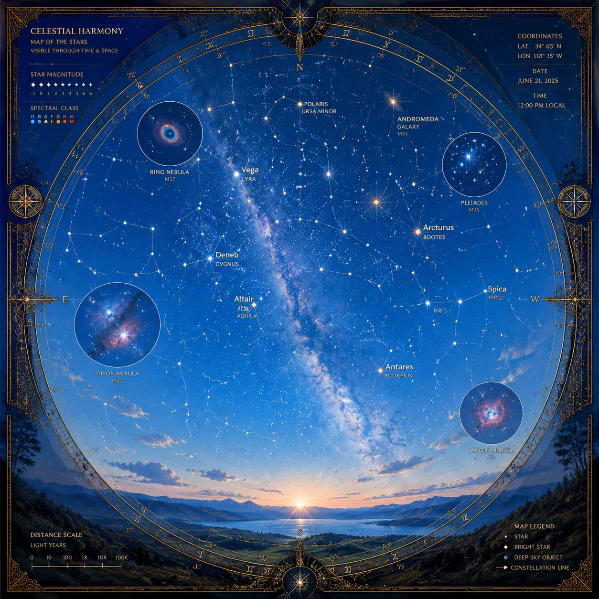

# Looks like galaxy got Sol

Well just an artistic impression :)

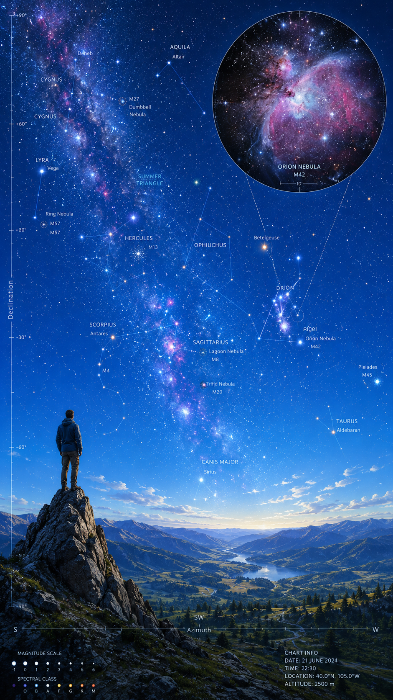

# Animals got picnic in the Parc

As we watch the Sky.

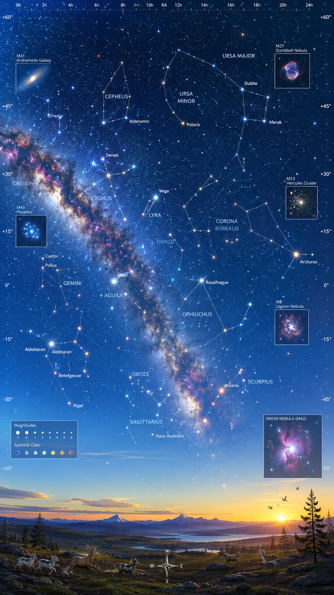

# Naturalist Vision of Big Bang

This kind of thing would fit into forest and natural lifestyles:
- Big bang without any exaggerated neon lights and other things, which might seem like bells and whistles to some people.
  - All kinds of special accelerations and other artificial addons are remains, and what remains is the actual core of natural materials, such as wood, textile, etc.

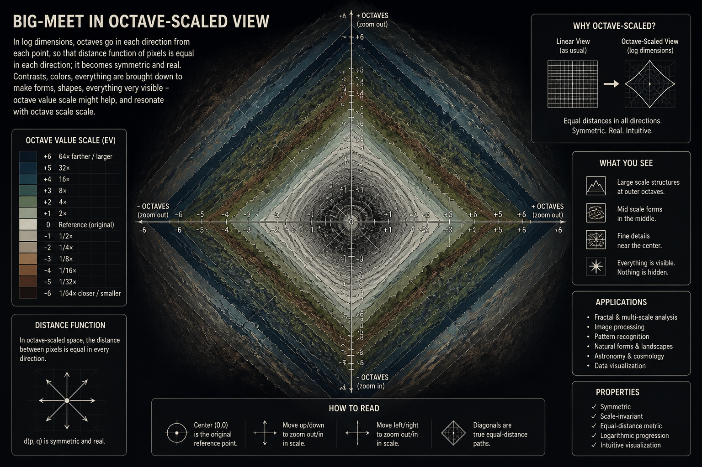

# Big Bang as Creation

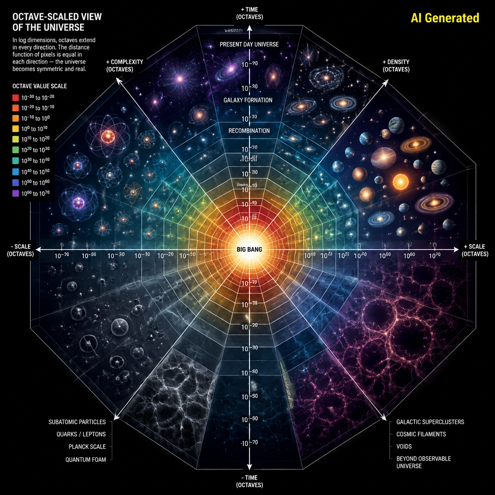

 

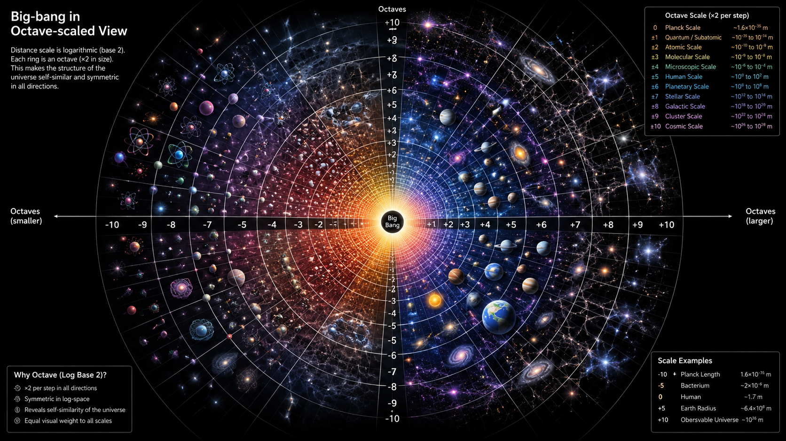

# Daytime Sky 1

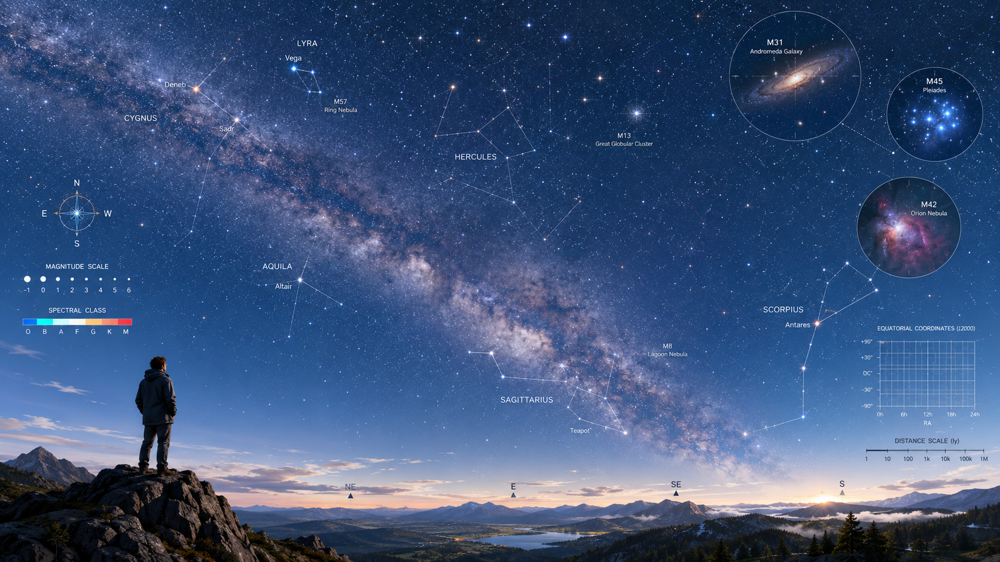

# Daytime Sky 2

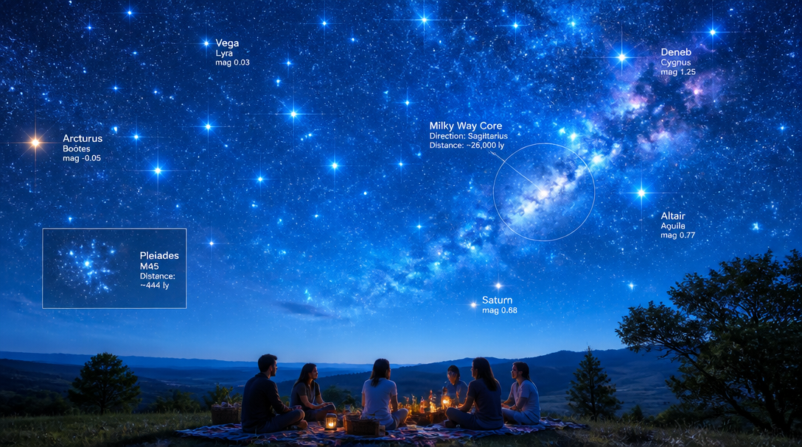

# Daytime Sky 3

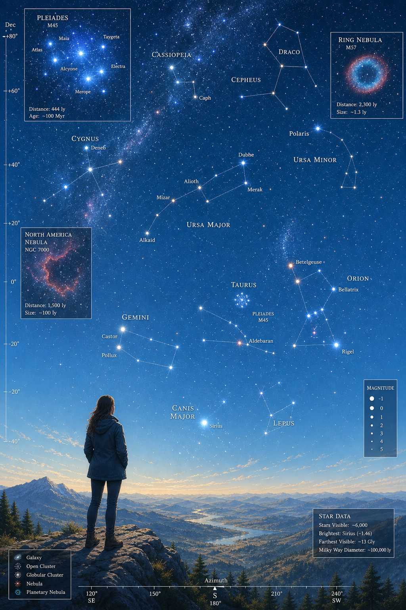

# Daytime Sky 4

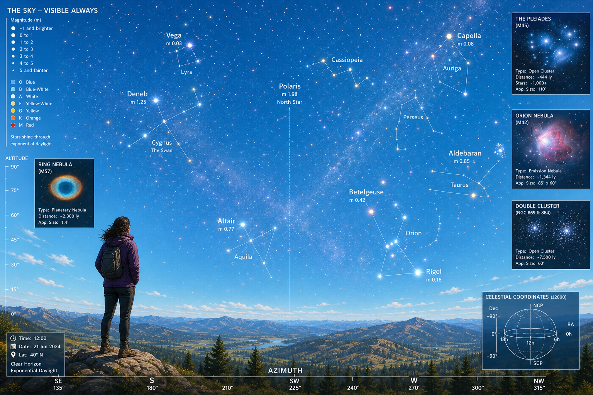

# B nice Sky Map

(because we already got A nice sky map)

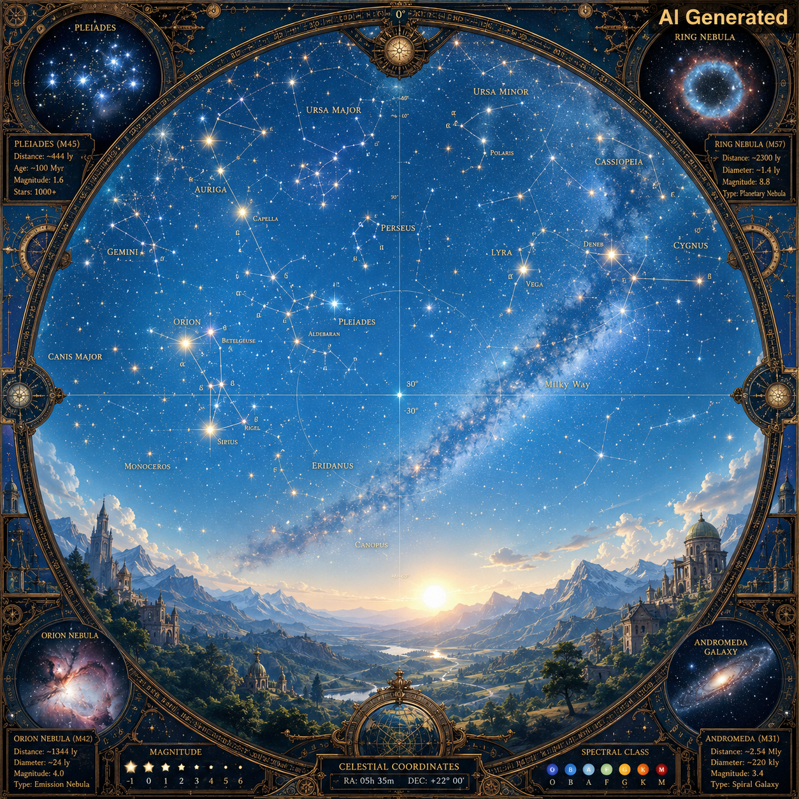
