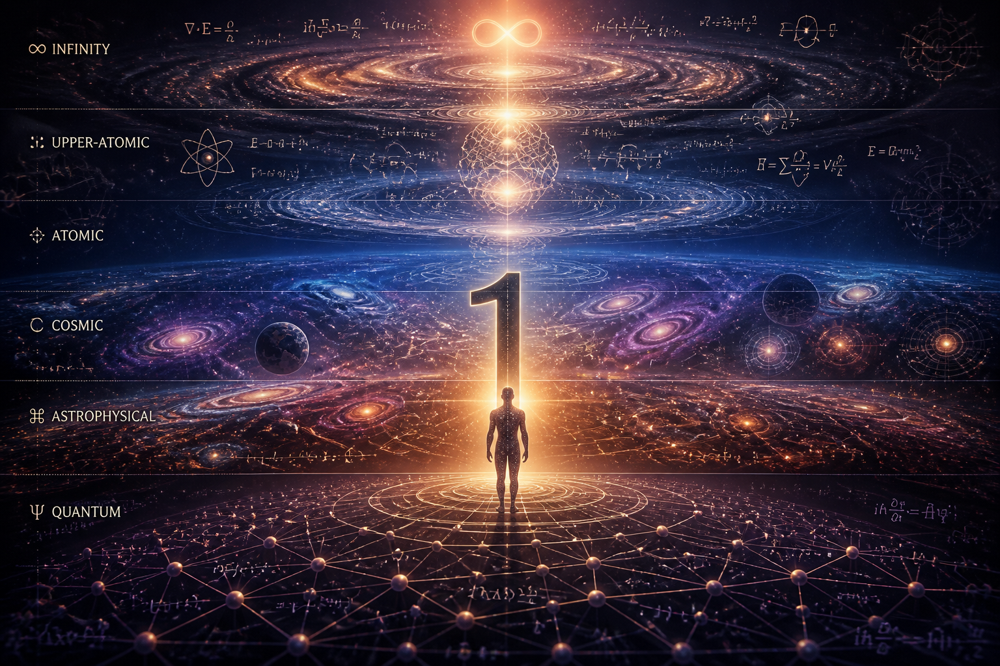
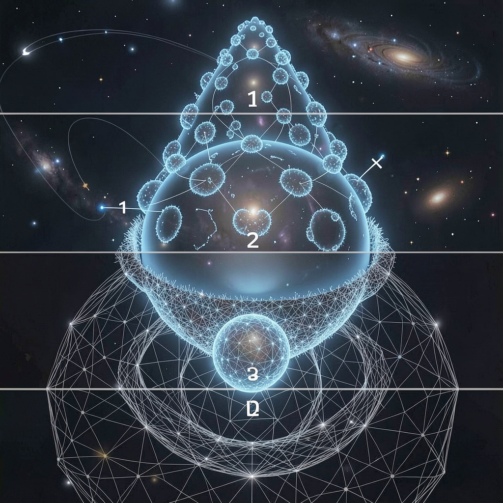
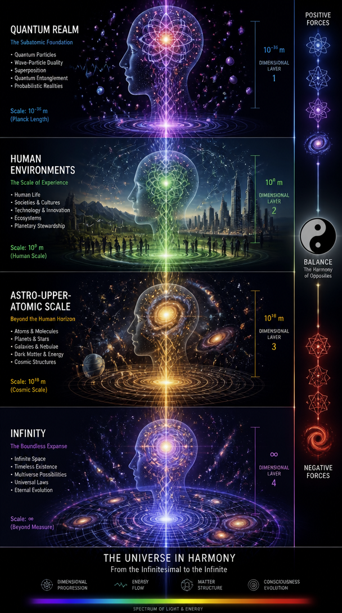
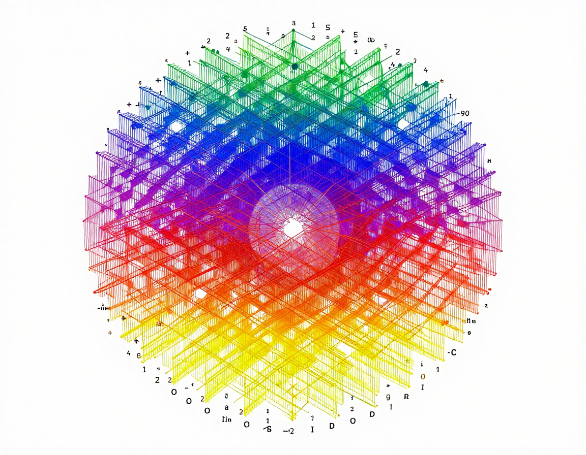
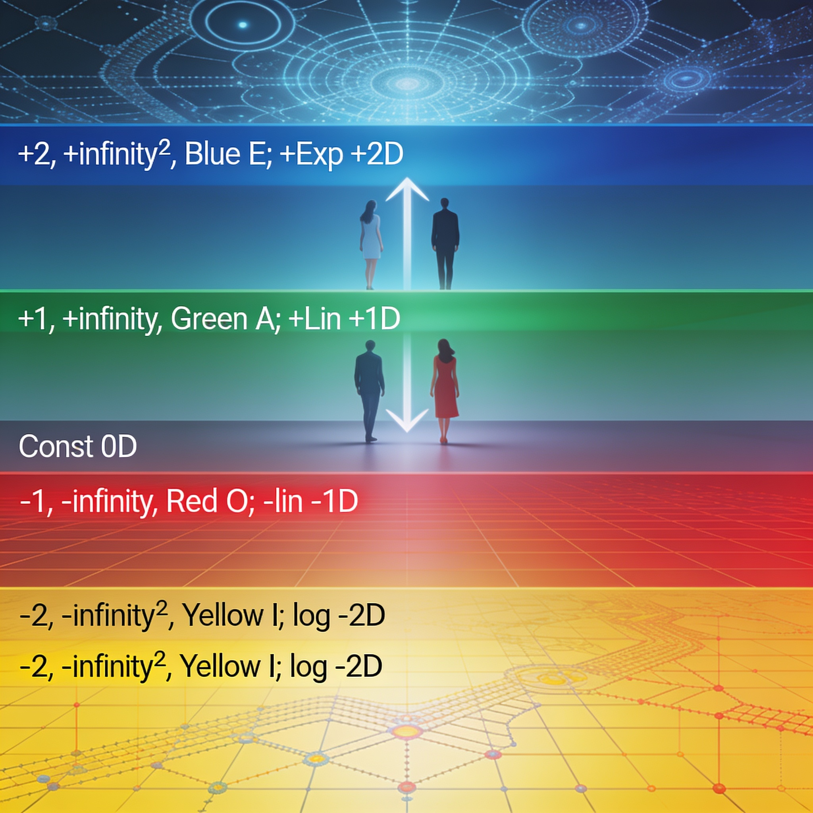
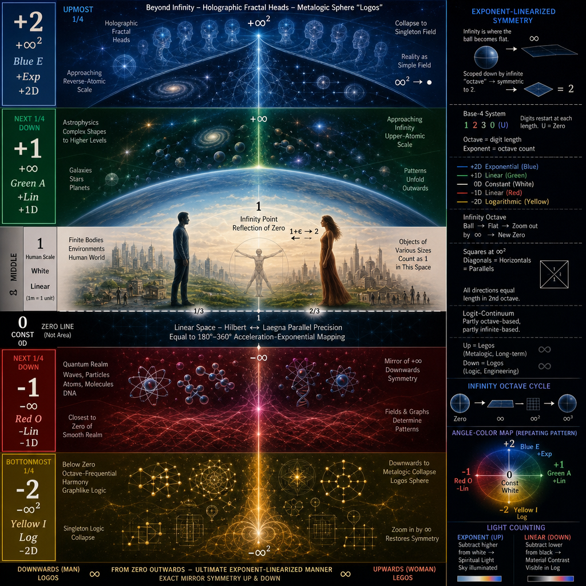

# Ten

A structure used by me to compress infinity into a digit.

Art follows THEN - H in Laegna, means High, m means Separate; it becomes high and separate for many, we try down to average on gaussian curve - altough we are not many, something is like sci-fi or fantasy, on actual math scales which appear, if we just try to imagine it. But the scales - are just mathematically there, responding over evolutions, eons, fantasies of space itself even more sci-fi. We can now imagine: Laegna Ferry, how to travel these highs of art-based oracles and symbolic realms depict as spatial correspondencies: can we find patterns *right here*, just to imagine the growth? Spatial structures could inspire us to evolve - but their math is symmetric to here and now, where we are tesimals, and this is why we passed the Yggdrasil chapter; what follows is *mathematical-physical philosophy*, symmetries, but I do not have the actual stars - rather, I have their spatial logic, and correspondence "as belove, so above" taken to exact math scales, and it's nicelike *physics*, hardlike *math*, freelike *spirit*, constituent in *arts*; it could form coherent mythos, basis for where to seek next - can we project physics down from the melting, singular, highs, where it becomes math and graphlike, to our environment, down to below-atom, below smallest linear unit to graphlike complexity again? 4 letters and base-4, 4-based symmetries, logexp linearization and their pattern-scalar projection in hologram fractal fields, united by integrity of art, are used as inspiration, and math - just reminds physics, more and more..

## One is Unit

Solar Plexus, Ego, Capitalism: one human, one object, one deal, counting by ones. Natural, human world of various beings.

Notice: Atomic actually refers to upwards-atomic, where macrophysics collapses outwards - I compare this to lower atomic, which reflects it in response to the "1", the unit, finite measure and harmonic, discrete-counted center of quadratic exponance.

## Wireframe Rendering

AI was trying to imagine what it means for fractal to grow, from micro to macroscale, in 4 steps - yet the actual image and even numbers appeared complicated to project here, but as a *wireframe*, it's important to use simple models to simplify conceptually: so it's also a simplified drawing, handsketch and draft, of what follows. This is structure of infinity, and on both directions, half further, topology and projectible logical scales and shapes; microworld, indeed, *is not made just from mushrooms* which is why the detail and separation level seems low.

## Minding the Zenfinity

Wireframe is simple, but it's all in brain appears complex, hard to imagine.

## Local at Infinity

This is artistic rendering of it, where green at top means *local in infinity* in Laegna, where you reproject it to below-zero, and scale to zero and smooth, external realm under approximations. This is artistic idea of this, as AI rendered out from my math complicates of what I want to see, depict, what is the formulae - well it *looks* like some imaginations of the formulae I was trying to pictuate and punctuate here. Base-4 loglinexp relations, linearized degrees, downsampled circle yet quite straight angles - this, all, is realistic thing what happens in Laegna Number Scope, as you travel to the Spheres and listen the music of, Octaves (to tell it like Christian):

## Dimensions

-2D, -1D, 1D, 2D - well, let's draw counting of dimensions, altough some hard math is hard to find here (number of dimensions, precision down or exp-octave scales up, but dimension in their vector storage which helps a lot)..

## Artistic imagination

Dimensions grow from subzero to infinity. Longer arrows point closer to infinity - as they multiply in times, if they are unit of their space, the same number of times, infinity the outer comes closer, until it collapses to zero, measured in degrees, harmonic to hilbert's outer space as it's magnitude-tesimal but directional-whole:

## Man and Woman

Woman - born in infinity (repetition, scale, harmony - spirit, the future), creating it's symmetries in finity (matter).

Man - born in finity, or zero or even infinity downwards (details, scope, engineering - matter of mind, the past), creating it's infinite projection - how the machine, the material, the local, would scope up in simple drawing of say, circle and triangle - already hard to constitute together so can Laegna math (it's not "non-strict", just keep going).

In exact center there is a child:
- Boy maps to +1, the model of their reality and higher reality.
- Girl maps the same to -1.
- Both are abs-1, precision-1, but girls avoid trouble and do good, while boys go trouble and do not avoid good: a shift in how they feel "genderness", altough they do not remain in their model - they play, and they compete, this is the long lesson of the long terms and outcomes, now. But the simple basis is easy to see - what we are evolved to do, what we can, and what we want, before we do this *effort whole whole*, where Daoism teaches to balance the two energies, which become material metaphors, and we avoid them in spiritual reality - where the long term goals make strong, adventurous girls up, and boys who just want to help the elder and feed the poor, for being Christians (for example).

## Sphere Art

Spheres of reality layers ..they just look like Art to our minds:

